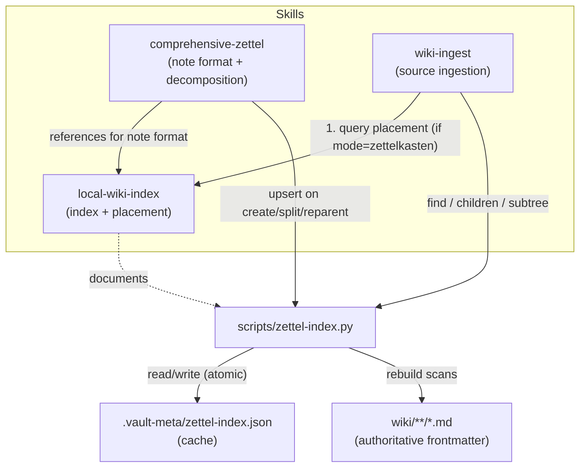
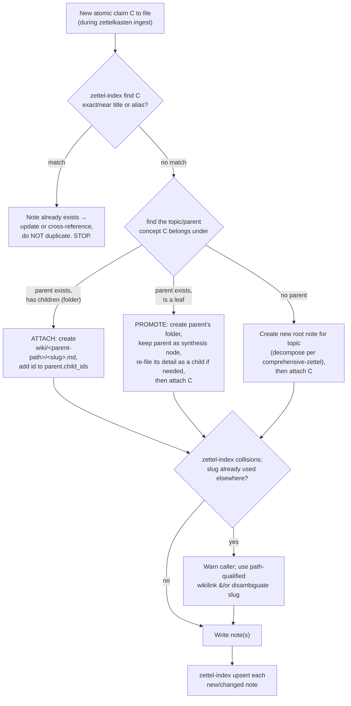

# feat: local-wiki-index Skill

Product Contract preservation: N/A — solo plan, no upstream brainstorm (`product_contract_source: ce-plan-bootstrap`).

## Summary

Add a project-local skill, `local-wiki-index`, that makes the folder-nested Zettelkasten structure (introduced in `.claude/skills/comprehensive-zettel/SKILL.md`) navigable and safe to grow during ingestion. It owns two coupled capabilities backed by one script (`scripts/zettel-index.py`):

1. **A rebuildable index sidecar** at `.vault-meta/zettel-index.json` mapping `id ↔ path ↔ title ↔ aliases ↔ parent_id ↔ child_ids`, so "does a note for X already exist, and where" and "what does this branch already cover" are O(1) lookups instead of a vault-wide read pass.
2. **An attach/promote placement procedure** that `wiki-ingest` consults before filing a new atomic note: find-or-create the parent, decide attach-as-child vs promote-a-leaf-to-parent, and slug-collision-check before writing.

The index is a **cache**, not source of truth — the note files' frontmatter is authoritative, and `rebuild` reconstructs the index by scanning `wiki/**/*.md` (mirrors `scripts/allocate-address.sh --rebuild`). This matters because files can move or vanish outside our control (Obsidian itself, the obsidian-git plugin — both observed this session).

---

## Problem Frame

The `comprehensive-zettel` skill now files notes as a folder-nested tree with plain-slug filenames (`wiki/Tokenization.md` beside `wiki/Tokenization/Byte-Pair-Encoding.md`), carrying `id`/`parent_id`/`child_ids` frontmatter. Once a path is known, navigation is trivial (`ls` the folder for children, `dirname` for parent). Three things are **not** solvable from the filesystem alone, and each blocks correct ingestion at any real vault size:

- **Existence/discovery** — a deep path like `wiki/Tokenization/Byte-Pair-Encoding/BPE-Merge-Algorithm.md` cannot be guessed from a concept name; checking whether a claim already has a note means reading candidate files, which collides with `wiki-ingest`'s "read only 3-5 existing pages per ingest" budget.
- **Placement** — deciding which existing parent a new atomic note attaches under, or whether an existing leaf must be promoted into a parent to absorb it, requires knowing the current shape of the relevant branch.
- **Slug collisions** — dropping the timestamp from filenames makes slugs only *sibling-unique*, not *vault-unique*. Two `Overview.md` leaves in different branches break bare `[[Overview]]` wikilinks. Nothing detects this today.

Scope of this plan: the index + placement skill and its wiring into the two consumer skills. It does **not** re-architect `comprehensive-zettel`'s note format (already done) or change `scripts/wiki-mode.py` routing.

---

## Requirements

- **R1** — A single script `scripts/zettel-index.py` maintains `.vault-meta/zettel-index.json` with commands for rebuild, incremental upsert/remove, and read queries (get, find, children, subtree, ancestors, collisions).
- **R2** — The index is rebuildable from scratch by scanning first-frontmatter blocks of `wiki/**/*.md`; a missing, empty, or corrupt index file triggers recovery rather than an error (mirrors `allocate-address.sh` counter recovery).
- **R3** — `find <text>` matches against title, aliases, and slug and returns candidate records (id, path, title) so a caller can detect an existing note before creating a duplicate.
- **R4** — `collisions` reports every slug used by more than one note across the tree, so callers know when a path-qualified wikilink is required.
- **R5** — Index writes are atomic (temp-file + rename) so a crash mid-write cannot corrupt the sidecar (mirrors `wiki-mode.py` `save_config`).
- **R6** — A skill doc `.claude/skills/local-wiki-index/SKILL.md` documents the index schema, the command reference, and the attach/promote placement decision procedure, and references `comprehensive-zettel` for note format.
- **R7** — `comprehensive-zettel` is updated to call the index (`upsert` on create/split/reparent; `collisions` check before choosing a slug) and to reference `local-wiki-index`.
- **R8** — `wiki-ingest` is updated to consult `local-wiki-index` placement **only when the vault mode is `zettelkasten`**, leaving generic/LYT/PARA ingestion unchanged.
- **R9** — The index sidecar and script never mutate note files — they only read frontmatter and read/write `.vault-meta/zettel-index.json`. Note creation/movement remains owned by the consumer skills.

---

## Key Technical Decisions

- **KTD1: One skill + one script.** `local-wiki-index` owns both the index and the placement procedure, backed by `scripts/zettel-index.py`. Placement queries are reads against the index, so the two are inseparable; splitting would produce a skill that cannot function alone. Matches the repo's existing skill+script pairing (`wiki-mode` + `wiki-mode.py`, allocate + `allocate-address.sh`). (User-confirmed at plan scoping.)
- **KTD2: Python script, not Bash.** JSON construction, frontmatter parsing, and tree queries are far cleaner in Python; `scripts/wiki-mode.py` is the precedent. `allocate-address.sh` is Bash only because it needs `flock`; this script needs no locking (single-writer ingest, cache is rebuildable).
- **KTD3: Cache, not source of truth.** Frontmatter (`id`/`parent_id`/`child_ids`) in the note files is authoritative; the JSON is a derived read-accelerator. Any drift is corrected by `rebuild`. Avoids the class of bug where the index and reality disagree after out-of-band file moves.
- **KTD4: Index lives in `.vault-meta/`.** Consistent with `mode.json`, `transport.json`, `address-counter.txt` — all machine-maintained, host-local runtime state. Filename `zettel-index.json`.
- **KTD5: Identity keyed on `id`, path is derived.** Because folder nesting encodes the hierarchy in the path, a rename/reparent changes the path but not the `id`. The index keys records by `id` so cross-references survive moves; `path` is a field, refreshed on every `rebuild`/`upsert`.
- **KTD6: Placement gated on zettelkasten mode.** `wiki-ingest` calls `python3 scripts/wiki-mode.py get`; only `zettelkasten` triggers the attach/promote path. Other modes keep their current folder-routed behavior untouched (honors the v1.8 mode-router contract).

---

## High-Level Technical Design

### Component / call graph



### Attach/promote placement decision (the core procedure)



The point: `wiki-ingest` reads only the handful of notes on the candidate parent chain (found via the index), not the whole vault — `subtree <id>` tells it what a branch already covers without opening every file.

---

## Output Structure

```
.claude/skills/local-wiki-index/
  SKILL.md                      # schema + command reference + placement procedure
scripts/
  zettel-index.py               # index maintenance + query CLI
tests/
  test_zettel_index.py          # follows tests/test_bm25_index.py pattern
.vault-meta/
  zettel-index.json             # generated at runtime (gitignore-consistent with other .vault-meta state)
```

---

## Implementation Units

### U1. `scripts/zettel-index.py` — index maintenance + query CLI

**Goal:** The backing script that builds, updates, and queries the index. This is the load-bearing unit; the skill doc and wiring depend on its command surface.

**Requirements:** R1, R2, R3, R4, R5, R9

**Dependencies:** none

**Files:**
- `scripts/zettel-index.py` (create)
- `tests/test_zettel_index.py` (create)

**Approach:**
- CLI subcommands (mirror `wiki-mode.py`'s argparse-subparser shape):
  - `rebuild` — walk `wiki/**/*.md`, parse the **first** YAML frontmatter block only (reuse the frontmatter-scan discipline from `allocate-address.sh`'s awk: ignore code-block and body content), collect `id`, `title`, `aliases`, `parent_id`, `child_ids`, and the vault-relative `path`; write the index atomically.
  - `get <id>` — one record as JSON.
  - `find <text>` — case-insensitive match over title + aliases + slug; return ranked candidate list (exact title, exact alias, then substring).
  - `children <id>` / `subtree <id>` / `ancestors <id>` — tree reads derived from `parent_id`/`child_ids` (guard against cycles and missing parents).
  - `collisions` — group records by slug (basename without `.md`); emit any slug with >1 record.
  - `upsert <path>` — parse one file's frontmatter, replace/add its record, atomic write.
  - `remove <path>` — drop the record for a path, atomic write.
- Index location resolution: `.vault-meta/zettel-index.json` relative to repo root (resolve root from script location like `wiki-mode.py`).
- Recovery: if the index file is missing/empty/corrupt on a read command, transparently `rebuild` first (print an INFO to stderr, like the counter recovery in `allocate-address.sh`), then answer.
- Atomic write: `tempfile.mkstemp` in `.vault-meta/` + `os.replace` (copy `wiki-mode.py` `save_config`).
- Never open note files for writing.

**Patterns to follow:** `scripts/wiki-mode.py` (argparse subparsers, atomic JSON write, repo-root resolution, exit codes); `scripts/allocate-address.sh` `scan_max_c_address` (first-frontmatter-only parsing) and `--rebuild` recovery semantics; `tests/test_bm25_index.py` (test harness shape).

**Test scenarios** (`tests/test_zettel_index.py`):
- `rebuild` on a fixture tree of 3 nested notes produces an index with correct `id`/`path`/`parent_id`/`child_ids` for each.
- `rebuild` ignores an `id:`-looking line inside a fenced code block in a note body (only first frontmatter counts).
- `find` returns the note when queried by its exact title, by an alias, and by a case-different substring; returns empty for an unrelated string.
- `children <id>` returns only direct children; `subtree <id>` returns the full descendant set; `ancestors <id>` returns the root-ward chain.
- `collisions` reports a slug used by two notes in different folders and stays silent when all slugs are unique.
- `upsert <path>` on a new file adds exactly one record without touching others; `remove <path>` drops exactly that record.
- Read command against a missing index file auto-rebuilds and still returns the correct answer (recovery path).
- Corrupt/truncated JSON in the index file is recovered by rebuild rather than raising.
- Atomic write: index content is valid JSON after every mutating command (no partial write left behind).
- `subtree`/`ancestors` terminate on a malformed tree (self-parent or missing parent) instead of infinite-looping.

**Verification:** `python3 scripts/zettel-index.py rebuild` on the live vault produces a `.vault-meta/zettel-index.json` containing the 19 existing zettel notes with correct parent/child fields; `make test` (or direct `python3 tests/test_zettel_index.py`) passes.

---

### U2. `.claude/skills/local-wiki-index/SKILL.md` — skill doc

**Goal:** Document the index schema, the `zettel-index.py` command reference, and the attach/promote placement decision procedure so both a human and an ingesting agent can follow it. This is the artifact `comprehensive-zettel` and `wiki-ingest` reference.

**Requirements:** R6

**Dependencies:** U1 (documents its command surface)

**Files:**
- `.claude/skills/local-wiki-index/SKILL.md` (create)

**Approach:**
- Frontmatter with `name`, `description` (trigger phrases: index the zettels, find a note, where does this note go, attach or promote, slug collision, rebuild the zettel index), `allowed-tools: Read Write Edit Bash`.
- Sections: Index Schema (the JSON record shape + that it's a cache keyed by `id`); Command Reference (each subcommand with a one-line example); the Placement Decision Procedure (the flowchart's steps as an ordered list — find → parent lookup → attach/promote/root → collision check → write → upsert); Collisions & path-qualified wikilinks; "Cache, not source of truth — run `rebuild` if in doubt"; a cross-reference to `comprehensive-zettel` for note format and to `scripts/wiki-mode.py get` for the mode gate.
- Keep the placement procedure the single canonical copy — `wiki-ingest` and `comprehensive-zettel` link here rather than restating it.

**Patterns to follow:** `.claude/skills/comprehensive-zettel/SKILL.md` (frontmatter + section shape just authored); `skills/wiki-cli/SKILL.md` (command-recipe reference style).

**Test scenarios:** Test expectation: none — documentation unit, no runtime behavior. Verified by review against U1's actual command surface (every documented command exists and every command has a doc entry).

**Verification:** Every subcommand in `SKILL.md`'s Command Reference matches a subcommand implemented in U1 (no drift in either direction); the placement procedure matches the HTD flowchart.

---

### U3. Wire `comprehensive-zettel` to the index

**Goal:** Make note creation/splitting keep the index current and collision-safe, and point readers at `local-wiki-index`.

**Requirements:** R7

**Dependencies:** U1, U2

**Files:**
- `.claude/skills/comprehensive-zettel/SKILL.md` (modify)

**Approach:** Minimal edits only:
- In the Decomposition Algorithm (parent/leaf split and file-creation steps), add: after writing or splitting a note, run `python3 scripts/zettel-index.py upsert <path>` for each new/changed note; when promoting a leaf to a parent, `upsert` both the new parent-synthesis node and the moved child.
- Before choosing a slug, run `python3 scripts/zettel-index.py collisions` (or `find <slug>`) and, on a hit, use a path-qualified wikilink / disambiguate.
- Add a short "See also: `local-wiki-index`" pointer for the index + placement contract; do not restate the placement procedure here.
- Do not otherwise change the note format, LaTeX rules, or folder-nesting design already in the file.

**Patterns to follow:** the existing "What NOT to Do" + numbered-algorithm style already in `comprehensive-zettel/SKILL.md`.

**Test scenarios:** Test expectation: none — skill-doc wiring, no runtime code. Verified by review: the upsert/collision steps reference real U1 commands and land at the correct points in the decomposition algorithm.

**Verification:** A dry read of the edited algorithm shows every note-write path is followed by an index `upsert`, and slug selection is preceded by a collision check.

---

### U4. Wire `wiki-ingest` to consult placement (zettelkasten mode only)

**Goal:** During ingestion, when the vault is in zettelkasten mode, use `local-wiki-index` placement to decide where new atomic notes go instead of blind creation — without changing behavior in other modes.

**Requirements:** R8

**Dependencies:** U1, U2

**Files:**
- `skills/wiki-ingest/SKILL.md` (modify)

**Approach:** Minimal, mode-gated edits in the "Mode awareness (v1.8+)" region and the Single/Batch ingest steps:
- Add a zettelkasten branch: after `python3 scripts/wiki-mode.py get` returns `zettelkasten`, follow the `local-wiki-index` placement procedure (find-or-create parent, attach vs promote, collision check, upsert) for each atomic note, and defer to `comprehensive-zettel` for the note body/decomposition.
- Explicitly state the other modes are unchanged (generic/LYT/PARA keep folder routing via `wiki-mode.py route`).
- Add `local-wiki-index` to the skill's cross-references.

**Patterns to follow:** the existing mode-awareness section in `skills/wiki-ingest/SKILL.md` that already special-cases LYT/PARA/Zettelkasten follow-ups; keep the same "consult the router, then act" shape.

**Test scenarios:** Test expectation: none — skill-doc wiring, no runtime code. Verified by review: the placement branch fires only under `zettelkasten`, and the non-zettelkasten path is explicitly preserved.

**Verification:** Reading the edited ingest flow, a non-zettelkasten ingest takes the unchanged path, and a zettelkasten ingest routes through the `local-wiki-index` placement procedure before any note write.

---

## Scope Boundaries

**In scope:** the index script (U1), the skill doc (U2), and minimal wiring edits into the two consumer skills (U3, U4).

**Out of scope / non-goals:**
- Changing `comprehensive-zettel`'s note format, LaTeX rules, or folder-nesting design (already implemented).
- Changing `scripts/wiki-mode.py` routing or the mode contract.
- Auto-migrating the existing 19 flat `wiki/<id>-<slug>.md` zettel notes into the nested folder structure — those were re-filed flat earlier this session; migrating them into true nested trees is separate follow-up work.

### Deferred to Follow-Up Work
- **Retroactive decomposition** of the 19 existing LLM-fundamentals notes into atomic + nested trees per the new `comprehensive-zettel` design (a content pass, not a tooling change).
- **Index locking** if multi-writer/parallel ingest is ever introduced (today ingestion is single-writer; the cache is rebuildable, so a lock is unnecessary now).
- **Fuzzy/semantic `find`** (embedding-based near-duplicate detection) — start with title/alias/slug matching; revisit if exact matching misses too many duplicates.

---

## Open Questions

- **Q1 (defer to implementation):** Should `.vault-meta/zettel-index.json` be gitignored (like `mode.json`, host-local) or committed? Lean gitignored for consistency with other `.vault-meta` runtime state and because it's rebuildable; confirm against the repo's existing `.gitignore` treatment of `.vault-meta/` during U1.
- **Q2 (defer to implementation):** Exact `find` ranking when a query matches multiple notes (e.g., an alias shared across two notes) — return all candidates and let the caller decide vs. pick a best match. Lean "return all candidates" so placement never silently picks the wrong parent.

---

## Risks & Dependencies

- **Index/reality drift** — mitigated by KTD3 (cache + `rebuild`) and R2 (auto-recover on read). The observed obsidian-git/Obsidian file moves this session are exactly why `rebuild` is a first-class command.
- **Slug-collision blind spots** — if a caller writes a note without running the collision check, bare wikilinks can silently resolve to the wrong note. Mitigated by making `collisions`/`find` a required step in both U3 and U4, and documenting the path-qualified-wikilink fallback in U2.
- **Command-surface drift** between the script (U1) and its doc (U2) / callers (U3, U4) — mitigated by U2/U3/U4 verification steps that cross-check against U1's actual subcommands.
- **Dependency:** U1 must land first; U2 documents it; U3/U4 wire it. U3 and U4 are independent of each other and can land in either order once U1+U2 exist.

---

## Sources & Research

- External research: **not run** — this is local convention work with strong in-repo precedents; no external option set or best-practice gap to resolve. Noted per plan contract.
- In-repo precedents: `scripts/wiki-mode.py` (argparse subparsers, atomic JSON write, repo-root resolution), `scripts/allocate-address.sh` (first-frontmatter scan, rebuild-on-missing recovery), `tests/test_bm25_index.py` (test harness shape), `.claude/skills/comprehensive-zettel/SKILL.md` (note format this skill supports), `skills/wiki-ingest/SKILL.md` §"Mode awareness (v1.8+)" (mode-gated branching pattern).
- Conversation context (this session): the folder-nested Zettelkasten redesign of `comprehensive-zettel`, the discovery/placement/collision gaps identified, and the user's confirmed one-skill-plus-one-script structure.

---

## Definition of Done

- `scripts/zettel-index.py` implements all commands in R1 with atomic writes (R5) and rebuild-recovery (R2); `tests/test_zettel_index.py` passes under `make test`.
- Running `rebuild` on the live vault indexes the existing zettel notes with correct parent/child/path fields.
- `.claude/skills/local-wiki-index/SKILL.md` documents schema, every command, and the placement procedure, with no drift from U1.
- `comprehensive-zettel` upserts the index on every note write and collision-checks before slug selection; `wiki-ingest` routes through placement only in zettelkasten mode with all other modes provably unchanged.
- The index never writes to note files (R9).
