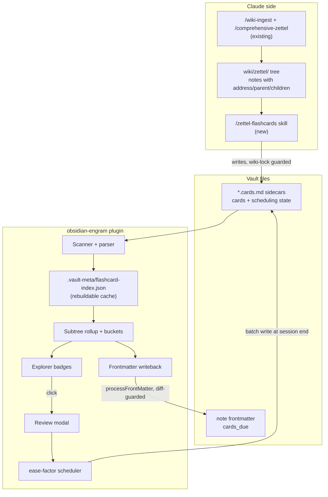
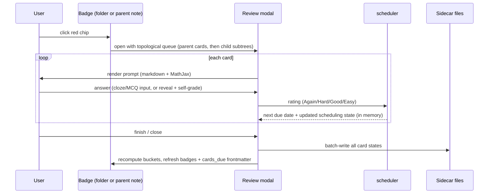

# Engram Flashcards — Spaced-Repetition Layer for the Zettel Tree - Plan

## Goal Capsule

- **Objective:** Build stage 1 of a memorization system over `wiki/zettel/`: a new BRAT-installable Obsidian plugin (`engram-flashcards`) that schedules per-atomic-note flashcards on an adjustable ease-factor ladder, runs topological mental-palace review sessions, shows clickable green/yellow/red due-count badges on folders and their parent notes in the file explorer, rolls counts up per subtree, and writes due counts into note frontmatter — plus a Claude skill that generates the flashcards.
- **Authority:** This plan; `skills/comprehensive-zettel/SKILL.md` conventions for anything touching the zettel tree; repo conventions in `CLAUDE.md`/`AGENTS.md`.
- **Stop conditions:** Surface instead of guessing if (a) the file-explorer DOM patch cannot attach badges to both folder and note rows reliably, (b) the card format cannot express cloze-inside-LaTeX without breaking MathJax rendering, or (c) frontmatter writeback creates commit loops with the vault's auto-commit hook.
- **Execution profile:** Greenfield TypeScript plugin in a new subdirectory + one new Claude skill; no changes to existing zettel note content beyond the already-present `cards_due` frontmatter field.
- **Tail:** Cut a tagged GitHub release with built assets so BRAT install is verifiable end-to-end.

---

## Product Contract

### Summary

Stage 1 delivers two artifacts: (1) a new TypeScript Obsidian plugin that parses flashcard sidecar files bound to atomic zettel notes, schedules them on an adjustable ease-factor interval ladder, renders clickable per-status count badges next to folders and their paired parent notes in the file explorer, rolls counts up per subtree, runs review sessions as topological walks of the subtree in a modal (auto-checked cloze/MCQ, self-graded free-response/derivation/pseudocode), and writes rolled-up due counts into each note's existing `cards_due` frontmatter field; and (2) a Claude Code skill that generates the card mix for any parent note + subfolder. Graph-view coloring and in-plugin card generation are out of scope for stage 1 but the frontmatter attribute is designed for the graph stage.

### Problem Frame

The vault's ingestion pipeline (`/wiki-ingest` + `/comprehensive-zettel`) reliably decomposes sources into a folder-nested tree of 131 atomic notes with stable DragonScale addresses. Reading the tree builds understanding, but nothing closes the retention loop: there is no way to quiz against the notes, no scheduling of review, and no visibility into which branches of the knowledge tree are memorized versus decaying. Existing Obsidian spaced-repetition plugins schedule cards but store them inline in note bodies (polluting atomic notes), treat decks as tags or flat folders, and offer no per-subtree due counts, no file-explorer badges, and no binding to a note-identity scheme that survives renames. The zettel frontmatter already reserves `cards_due` and `subtree_size` fields — the schema anticipated this feature; nothing populates it.

### Requirements

**Card generation (Claude-side)**

- R1. A Claude Code skill generates flashcards for a given parent note + subfolder, producing cards for every atomic note in that subtree.
- R2. Generated cards mix types per note content: fill-in-the-blank (cloze), multiple choice, free-response, equation derivation / fill-in-the-equation for notes with LaTeX, and pseudocode where algorithmic.
- R3. Cards target comprehensive understanding of the note's claim and reasoning, following spaced-repetition card-writing principles (atomic prompts, no orphan context, both recognition and recall directions).
- R4. Each card is durably bound to its source note by DragonScale `address`, so cards survive note renames and moves.
- R5. Cards live in sidecar files alongside each atomic note — never inside the note body.

**Scheduling**

- R6. Review scheduling uses an ease-factor interval ladder: first successful review ~1 day out, second ~4 days, then each success multiplies the interval by an adjustable ease factor (default 2.5), yielding ≈ 1 → 4 → 10 → 25 → 60 → 150 days; failures lapse back to the ladder start. Each card carries its own scheduling state including an append-only review log.
- R7. Card status buckets: red = due or overdue; yellow = due within a configurable warn window (default 24h); green = neither.
- R8. Review history and scheduling state survive vault sync and git — no state lives only in gitignored plugin storage.

**Explorer badges and review**

- R9. The file explorer shows per-status count badges (colored square with digit) on every zettel folder and on the folder's paired parent note (`X/` and sibling `X.md` show identical rollups).
- R10. Folder badges roll up all cards in the subtree; leaf-note badges show the note's own cards.
- R11. Clicking a badge chip (on either the folder or the parent-note row) starts a review session scoped to that subtree and that chip's bucket: red → due cards, yellow → soon-due early review, green → optional practice-ahead.
- R12. Review sessions render each card type appropriately: cloze and MCQ are answered in-modal and auto-checked; free-response, derivation, and pseudocode cards reveal the answer for Anki-style self-grading (Again/Hard/Good/Easy). All card faces render markdown + LaTeX.
- R16. A folder session walks the subtree topologically — the parent note's cards first, then each child subtree recursively (a mental-palace walk) — never randomly sampling across the folder; when a parent's cards are all green, the session still opens with a small reorientation sample of them before descending, and a setting allows skipping green parents entirely.

**Rollup and graph groundwork**

- R13. Each note's current due count is written to its `cards_due` frontmatter field (parents get subtree rollups, leaves get own-card counts), refreshed on vault open and after each review session, writing only when the value changed.
- R14. Subtree due counts are computed from the folder hierarchy that `comprehensive-zettel` defines (folder path = parent chain), consistent with `scripts/zettel-index.py`.

**Distribution**

- R15. The plugin is installable via BRAT from this repo: GitHub releases carry `main.js`, `manifest.json`, `styles.css`, with the release tag exactly matching the manifest version.

### Key Flows

- F1. Generate cards for a subtree
  - **Trigger:** User asks Claude to "generate flashcards for Optimization-Methods" (or any parent note / subfolder).
  - **Steps:** Skill reads the parent note and every descendant note (via `zettel-index.py subtree`); for each atomic note writes/updates a card sidecar file guarded by `wiki-lock`; reports card counts per note.
  - **Outcome:** Sidecar files exist for each note; the plugin picks them up on next scan and badges appear.
- F2. Review from a badge
  - **Trigger:** User clicks the red badge on the `Optimization-Methods` folder (or its parent note row).
  - **Steps:** Plugin builds the session queue as a topological walk of the subtree — parent cards first, then each child subtree recursively, with reorientation samples from green parents unless skipped — opens the review modal, grades each answer to a rating, reschedules the card.
  - **Outcome:** At session end, scheduling state is written back to sidecars in one batch, badges refresh, and `cards_due` frontmatter updates.
- F3. Passive status awareness
  - **Trigger:** User opens the vault.
  - **Steps:** Plugin scans sidecars, computes buckets and rollups, renders badges, reconciles `cards_due` frontmatter where changed.
  - **Outcome:** Explorer shows the memory-state map of the whole tree with zero user action.

### Acceptance Examples

- AE1. **Given** the `Optimization-Methods` subtree has 30 cards due, **when** the user looks at the file explorer, **then** both the `Optimization-Methods` folder row and the `Optimization-Methods.md` note row show a red badge reading 30, and clicking either starts a session over those 30 cards.
- AE2. **Given** the user completes that session rating every card, **when** the modal closes, **then** the badge turns green/yellow per the new schedule and `cards_due` in `Optimization-Methods.md` frontmatter reflects the new due count.
- AE3. **Given** a cloze card whose blank sits inside a LaTeX equation, **when** it renders in the review modal, **then** the equation renders via MathJax with the blank masked and the revealed answer renders the full equation.
- AE4. **Given** a note is renamed or moved to a different folder, **when** the plugin rescans, **then** its cards (found by `address`) stay bound with full scheduling history intact.
- AE5. **Given** a fresh vault with BRAT installed, **when** the user adds this repo's path in BRAT, **then** the plugin installs from the latest GitHub release and loads.

### Scope Boundaries

- **In scope:** the plugin, the generation skill, badges on folders/parent notes/leaf notes, review modal with topological sessions, ease-factor scheduling, `cards_due` writeback, BRAT release pipeline.
- **Deferred for later (stage 2+):** graph-view node coloring by `cards_due` (this plan only guarantees the frontmatter attribute it will read); adopting FSRS as an alternative scheduler (the append-only review log keeps this migration lossless); review heatmaps/statistics; mobile-optimized review UI (stage 1 is desktop-first; mobile must not error but badges may degrade).
- **Deferred to Follow-Up Work:** generating cards for all 131 existing notes (the skill ships validated on one subtree; bulk generation is a usage task, not build work); Anki export; `wiki-lint` checks for orphaned card sidecars.
- **Outside this product's identity:** card generation inside the plugin via LLM API calls — generation stays Claude-side by design, keeping the plugin free of API keys and network calls.

---

## Planning Contract

### Key Technical Decisions

- KTD1. **Build a new plugin with a hand-rolled ease-factor scheduler; do not adapt an existing SR plugin.** The landscape scan confirmed no existing plugin fits: `st3v3nmw/obsidian-spaced-repetition` (FSRS + SM-2) stores cards inline in note bodies and has no explorer badges, subtree rollups, or note-identity binding; the standalone `FSRS` plugin (evgene-kopylov) treats the whole note as one card. Forking either means fighting their storage model to satisfy R5/R9/R13. The scheduler implements R6's ladder directly (SM-2 family, a few dozen lines matching the required behavior exactly); FSRS (`ts-fsrs`) was evaluated and deferred — the state block's append-only review log means it can be swapped in later without losing history.
- KTD2. **Cards + scheduling state live together in one sidecar markdown file per atomic note** (`<Note>.cards.md` beside `<Note>.md`). Card content is Claude-authored markdown; per-card scheduling state is a plugin-managed machine block inside the same file, batch-written at session end. Rationale: R8 rules out `.obsidian/plugins/*/data.json` (gitignored per `.gitignore`); a committed sidecar keeps content and state atomic per note, git-diffable, and Claude-readable. `.vault-meta/flashcard-index.json` caches the scan as a rebuildable index, mirroring `zettel-index.py`'s cache-not-truth pattern.
- KTD3. **Sidecars are hidden from the file explorer by the plugin** (toggleable). Sidecars would double the visible tree and pollute the graph; the plugin hides `*.cards.md` rows the same way Hide-Index-Files-style plugins patch tree items. Graph pollution is handled by the graph stage later (sidecars carry no wikilinks by default).
- KTD4. **Badges are DOM decorations on file-explorer tree items, mirroring the `file-explorer-note-count` technique.** The explorer has no official decoration API; patching rendered tree items with defensive re-render hooks is the established community pattern. Folder→parent-note pairing follows the `comprehensive-zettel` convention: folder `X/` pairs with sibling `X.md`; both rows get the identical subtree rollup badge set (R9). Up to three chips per row (red/yellow/green), zero-count chips omitted except green, which always shows the remaining healthy count when any cards exist.
- KTD5. **`cards_due` writeback uses Obsidian's `FileManager.processFrontMatter`, diff-guarded.** Write only when the computed value differs from the stored one; refresh on vault open, session end, and an explicit "Refresh flashcard counts" command. This bounds churn: Claude-side hook auto-commits only fire on Claude writes, and obsidian-git commits stay small. `cards_due` = red-bucket count (due now); the yellow window is display-only and not persisted, keeping the frontmatter contract minimal for the graph stage.
- KTD6. **Auto-checked card types map correctness to ratings conservatively:** correct → Good, incorrect → Again, with a one-tap override to Hard/Easy after reveal. Self-graded types present the standard four-button rating. Ratings drive the ladder Anki-style: Good multiplies by ease, Hard dampens and nudges ease down, Easy boosts and nudges ease up, Again lapses to the ladder start with an ease penalty (ease floor 1.3).
- KTD7. **Plugin lives in `obsidian-engram/` in this repo; BRAT installs from GitHub release assets.** BRAT (≥1.1.0) fetches `manifest.json` from release assets, so a repo-subdirectory plugin works as long as releases carry `main.js`/`manifest.json`/`styles.css` and the tag exactly equals the manifest version (no `v` prefix). Plugin id `engram-flashcards`.
- KTD8. **The card format spec is a single shared reference document** consumed by both the plugin parser and the generation skill (`docs/flashcard-format.md`). One source of truth prevents skill/parser drift; the skill links it, the parser's fixtures quote it.
- KTD9. **Session queues follow the note topology (mental-palace walk).** A folder session is a depth-first walk: the parent note's cards, then each child subtree in the order the parent's `children` frontmatter lists them (folder sort as fallback). All-green parents contribute a small reorientation sample (default 3 cards) so the walk re-anchors context before descending; a skip-green-parents setting disables this. Shuffling applies only within a single note's cards, never across notes.

### High-Level Technical Design

Component and data flow — how the Claude side and the Obsidian side meet at the sidecar files:



Review session lifecycle:



Bucket classification (evaluated per card at scan/refresh time):

| Bucket | Condition | Chip | Counts toward `cards_due` |
|---|---|---|---|
| Red | `due <= now` | red square + count | yes |
| Yellow | `now < due <= now + warn window` (default 24h) | yellow square + count | no |
| Green | `due > now + warn window` (or new card not yet introduced — see Open Questions) | green square + count | no |

Card sidecar shape (directional guidance, not implementation specification — U1 owns the final spec):

```markdown
---
type: flashcards
note_address: "c-000022"
note_title: "MoE Architecture"
---

### card c-000022-01
type: cloze
The MoE layer output is $\text{MoE}(x) = \sum_{i=1}^{N} {{g_i(x)\, E_i(x)}}$ ...

### card c-000022-02
type: mcq
Why do MoE models report both total and active parameter counts?
- [ ] distractor …
- [x] answer …

%% srs c-000022-01 {"due":"2026-07-18T09:00:00Z","interval":4,"ease":2.5,"reviews":[...]} %%
%% srs c-000022-02 {"state":"new"} %%
```

### Sequencing

U1 (format spec) unblocks everything. U2 (scaffold) is independent and can proceed in parallel. U3–U7 build the plugin in dependency order on U1+U2. U8 (skill) needs only U1 and produces the real cards U5/U6 are smoke-tested against. U9 closes with release + docs.

---

## Implementation Units

### U1. Card format and binding specification

- **Goal:** One authoritative spec for the sidecar file: card block syntax, the five card types and their answer semantics, card IDs (`<address>-<nn>`), the scheduling state block (due, interval, ease, append-only review log), and the note-binding rules (address, sidecar naming, regeneration/merge behavior when cards already exist).
- **Requirements:** R2, R4, R5, R6, R8.
- **Dependencies:** none.
- **Files:** `docs/flashcard-format.md`.
- **Approach:** Specify cloze syntax that composes with LaTeX (delimiter choice must not collide with `$...$`, `{{...}}` inside math needs an explicit masking rule — this is the spec's hardest requirement, per AE3). Define how the plugin preserves scheduling state blocks when the skill regenerates card content (state keyed by card ID; regeneration keeps IDs stable for unchanged cards, retires IDs for removed cards). Follow `skills/obsidian-markdown/SKILL.md` §Math for LaTeX rules.
- **Test scenarios:** Test expectation: none — spec document; its behaviors are enforced by U3/U8 fixtures that quote it.
- **Verification:** Spec covers all five card types with one full example each, including a cloze-inside-equation example; U3 and U8 both link to it.

### U2. Plugin scaffold and BRAT release pipeline

- **Goal:** A building, loadable, empty plugin in `obsidian-engram/` with a release workflow BRAT can install from.
- **Requirements:** R15.
- **Dependencies:** none.
- **Files:** `obsidian-engram/manifest.json`, `obsidian-engram/package.json`, `obsidian-engram/tsconfig.json`, `obsidian-engram/esbuild.config.mjs`, `obsidian-engram/src/main.ts`, `obsidian-engram/styles.css`, `obsidian-engram/versions.json`, `.github/workflows/release-plugin.yml`, `obsidian-engram/README.md`.
- **Approach:** Standard obsidian-sample-plugin layout (esbuild, TypeScript strict) with zero runtime dependencies (the scheduler is hand-rolled per KTD1), plus a settings tab (zettel root path defaulting to `wiki/zettel/`, warn window, ease factor, hide-sidecars toggle, practice-ahead toggle, skip-green-parents toggle). Release workflow triggers on tags matching the manifest version (no `v` prefix — BRAT/Obsidian require tag == manifest version exactly) and uploads `main.js`, `manifest.json`, `styles.css` as release assets. Plugin id `engram-flashcards`, `isDesktopOnly: false` but desktop-first behavior per Scope Boundaries. README documents the BRAT install path.
- **Execution note:** Mostly packaging/config; prefer build + load smoke verification over unit coverage.
- **Patterns to follow:** obsidianmd sample plugin conventions; the semantic-release-free minimal tag→release flow from the BRAT developer guide.
- **Test scenarios:** Test expectation: none — scaffolding; verified by build and load smoke.
- **Verification:** `npm run build` in `obsidian-engram/` emits `main.js`; copying build output into `.obsidian/plugins/engram-flashcards/` loads without console errors; CI workflow dry-runs green.

### U3. Sidecar parser, vault scanner, and flashcard index

- **Goal:** Parse `*.cards.md` files into typed card objects with scheduling state; scan the zettel tree; maintain `.vault-meta/flashcard-index.json` as a rebuildable cache keyed by note address.
- **Requirements:** R4, R5, R14.
- **Dependencies:** U1, U2.
- **Files:** `obsidian-engram/src/cards/parser.ts`, `obsidian-engram/src/cards/types.ts`, `obsidian-engram/src/index/scanner.ts`, `obsidian-engram/src/index/flashcard-index.ts`, `obsidian-engram/tests/parser.test.ts`, `obsidian-engram/tests/scanner.test.ts`, fixture sidecars under `obsidian-engram/tests/fixtures/`.
- **Approach:** Parser is pure (string in, cards out) so it tests without Obsidian APIs. Scanner walks the zettel root via Obsidian vault API — the root is a plugin setting defaulting to `wiki/zettel/`, so BRAT installs into other vaults work — incremental on file-change events, full rebuild on demand; the index is cache-not-truth, mirroring `scripts/zettel-index.py`. Subtree membership derives from folder paths (folder path = parent chain per `comprehensive-zettel`). A sidecar whose `note_address` resolves to no existing note is orphaned: excluded from rollups and sessions, surfaced in a plugin notice.
- **Patterns to follow:** `scripts/zettel-index.py` (rebuildable index, auto-recover on corrupt cache, atomic JSON writes).
- **Test scenarios:**
  - Happy path: fixture sidecar with all five card types parses into five typed cards with correct IDs and scheduling state attached by ID.
  - Covers AE4. Note moved to a different folder: rescan rebinds the sidecar by `note_address`, scheduling state intact.
  - Edge: sidecar with cards but no state blocks (fresh generation) → all cards state new.
  - Edge: state block referencing a card ID absent from the file → state preserved but flagged orphaned, not crashed.
  - Edge: empty sidecar, sidecar with malformed frontmatter, card block with unknown `type` → skipped with a logged warning, remaining cards parse.
  - Edge: orphaned sidecar (its `note_address` resolves to no existing note) → flagged orphaned, excluded from rollups and sessions, plugin notice raised; other sidecars unaffected.
  - Edge: custom zettel-root setting → scanner walks the configured root, not the default.
  - Error path: corrupt `flashcard-index.json` → transparent rebuild, no data loss (state lives in sidecars).
- **Verification:** `npm test` green; opening this vault with real generated sidecars (U8) populates the index with correct per-note card counts.

### U4. Ease-factor scheduling and bucket engine

- **Goal:** Implement the ease-factor scheduler: rate a card → new interval, ease, due date, and appended review-log entry; classify any card into red/yellow/green; compute per-note and per-subtree rollups.
- **Requirements:** R6, R7, R10, R14.
- **Dependencies:** U3.
- **Files:** `obsidian-engram/src/scheduler/scheduler.ts`, `obsidian-engram/src/scheduler/buckets.ts`, `obsidian-engram/src/scheduler/rollup.ts`, `obsidian-engram/tests/scheduler.test.ts`, `obsidian-engram/tests/rollup.test.ts`.
- **Approach:** Ladder per R6: first success → 1 day, second → 4 days, then interval × ease on Good (ease default 2.5, adjustable in settings, floor 1.3). Anki-style modifiers per KTD6: Hard uses a dampened multiplier and nudges ease down; Easy adds a bonus multiplier and nudges ease up; Again lapses to the ladder start with an ease penalty. State (due, interval, ease, review log) serializes losslessly into the sidecar state block (U1 spec); the review log is append-only so a future FSRS swap loses nothing. Buckets per the classification table in High-Level Technical Design; warn window a plugin setting (default 24h). Rollup: leaf count = own cards; folder/parent-note count = subtree sum including the parent note's own cards.
- **Test scenarios:**
  - Ladder progression: a new card rated Good repeatedly at default ease follows ≈ 1 → 4 → 10 → 25 → 62 → 156 days; each review appends one log entry.
  - Ease adjustability: changing the ease setting alters multipliers for subsequent reviews only, never rewrites past state.
  - Lapse: Again mid-ladder returns the card to 1 day and penalizes ease; ease never drops below the 1.3 floor.
  - Round-trip: state (including review log) serializes and re-parses identically.
  - Bucket boundaries: card due exactly now → red; due in warn-window-minus-a-minute → yellow; due beyond window → green; overdue by days → red.
  - Rollup: three-level fixture tree — leaf counts sum into parent, parent's own cards included, sibling subtrees independent.
  - Edge: note with no sidecar contributes zero without erroring; empty folder shows no badge.
- **Verification:** `npm test` green; the default-ease ladder sequence is pinned by an exact-progression test; bucket counts over the fixture tree match hand-computed values.

### U5. File-explorer badges and click-to-review wiring

- **Goal:** Render per-status count chips on zettel folder rows, paired parent-note rows, and leaf-note rows; clicking a chip launches a review session scoped to that subtree; hide `*.cards.md` rows.
- **Requirements:** R9, R10, R11 (launch side), plus KTD3 hiding.
- **Dependencies:** U4.
- **Files:** `obsidian-engram/src/ui/explorer-badges.ts`, `obsidian-engram/src/ui/pairing.ts`, `obsidian-engram/styles.css`, `obsidian-engram/tests/pairing.test.ts`.
- **Approach:** Patch rendered file-explorer tree items (the `file-explorer-note-count` technique): decorate on explorer render events, re-decorate on index updates, degrade silently if the explorer view is absent (mobile or replaced). Pairing rule: folder `X/` ↔ sibling note `X.md`; both receive the identical rollup badge set. Chips: red/yellow/green squares with counts, zero-count chips omitted except green (always shown when the subtree has any cards). Each chip is an independent click target: red opens the subtree's due cards, yellow opens an early-review session over soon-due cards, green opens an optional practice-ahead session (settings-gated, default on). Clicks stop propagation (must not toggle folder collapse or open the note).
- **Execution note:** DOM patching is untestable in vitest; keep all logic (pairing, chip selection, counts) in pure functions with the DOM layer as a thin shell, and verify the shell by smoke in this vault.
- **Patterns to follow:** `ozntel/file-explorer-note-count` for tree-item decoration and re-render defensiveness.
- **Test scenarios:**
  - Pairing: `wiki/zettel/LLMs/Architecture.md` pairs with `wiki/zettel/LLMs/Architecture/`; a leaf with no same-named folder pairs with nothing; a folder with no same-named sibling note gets a folder badge only.
  - Chip selection: counts (0 red, 3 yellow, 10 green) → yellow "3" + green "10", no red chip; (0,0,0) with no cards → no chips at all.
  - Chip semantics: red click queues due cards only; yellow click queues soon-due cards; green click queues a practice-ahead session, and with practice-ahead disabled in settings the green chip is inert.
  - Covers AE1 (manual): folder and parent note rows show identical badges; clicking either row's red chip opens the same session.
- **Verification:** In this vault with generated cards: badges visible on `Optimization-Methods` folder and note rows with matching counts; sidecar rows hidden; clicking a chip opens the modal; folder expand/collapse unaffected.

### U6. Review modal

- **Goal:** A modal session that walks the subtree topologically, renders each card type, accepts answers, grades to ratings, and batch-writes state at session end.
- **Requirements:** R11 (session side), R12, R16, R8.
- **Dependencies:** U4.
- **Files:** `obsidian-engram/src/ui/review-modal.ts`, `obsidian-engram/src/ui/renderers/` (one renderer per card type), `obsidian-engram/src/ui/grading.ts`, `obsidian-engram/src/ui/session-queue.ts`, `obsidian-engram/tests/grading.test.ts`, `obsidian-engram/tests/session-queue.test.ts`, `obsidian-engram/styles.css`.
- **Approach:** The session queue is a pure function implementing KTD9's mental-palace walk over the flashcard index: the subtree root's parent-note cards first, then each child subtree recursively in `children` order; the clicked chip's bucket filters which cards enter; all-green parents contribute the reorientation sample unless skipped in settings. All card faces render through Obsidian's `MarkdownRenderer` so LaTeX and code blocks work for free. Cloze: masked render, text input or reveal; MCQ: shuffled options, click to answer; free-response/derivation/pseudocode: prompt → reveal → four-button self-grade. Auto-checked grading per KTD6 (correct → Good, incorrect → Again, post-reveal override available). The whole session is keyboard-operable: space/enter reveals, keys 1–4 rate (Again/Hard/Good/Easy), for both self-graded cards and post-reveal overrides. Session state is in-memory until the end-of-session batch write (F2); closing mid-session writes completed cards only.
- **Test scenarios:**
  - Grading: MCQ correct → Good; incorrect → Again; override after reveal replaces the auto rating before scheduling.
  - Covers AE3 (manual): cloze inside `$$...$$` renders masked equation, reveal renders the full equation.
  - Covers R16. Queue order: fixture tree → the parent note's cards precede all child cards; sibling subtrees appear in the parent's `children` order; cards may shuffle within a note but never interleave across notes.
  - Green-parent reorientation: an all-green parent contributes its sample (default 3 cards) ahead of due children; with skip-green-parents enabled it contributes none.
  - Session flow: mid-session close persists only rated cards; empty due set opens a "nothing due" state, offering yellow-bucket early review.
  - Keyboard: space/enter reveals; 1–4 rate a revealed card; keyboard rating works identically on self-graded and auto-checked-override paths.
  - Edge: card whose note was deleted since scan → skipped with notice, session continues.
- **Verification:** Full session over the U8-generated subtree on desktop: every card type renders and grades; sidecar state blocks updated once at session end; badges refresh immediately after.

### U7. `cards_due` frontmatter writeback

- **Goal:** Keep every zettel note's `cards_due` frontmatter equal to its current red-bucket count (subtree rollup for parents, own cards for leaves) so the future graph stage can color nodes from frontmatter alone.
- **Requirements:** R13.
- **Dependencies:** U4.
- **Files:** `obsidian-engram/src/frontmatter/writeback.ts`, `obsidian-engram/tests/writeback.test.ts`.
- **Approach:** `FileManager.processFrontMatter` per note, strictly diff-guarded (skip when stored == computed). Triggers: vault open (after first full scan), review-session end, and a command-palette "Refresh flashcard counts". Never touch any other frontmatter field; never create `cards_due` on non-zettel files (guard on `type: zettel`).
- **Test scenarios:**
  - Diff guard: unchanged value → no write call; changed value → exactly one write with only `cards_due` modified.
  - Covers AE2: after a session clears a subtree, the parent note's `cards_due` drops to the new due count.
  - Edge: note without `type: zettel` in a zettel folder → untouched; note missing `cards_due` field entirely → field added.
  - Error path: frontmatter write fails (file locked/deleted) → logged, other notes still processed.
- **Verification:** Toggle a card due (system clock or debug command), run refresh: exactly the affected ancestor chain's `cards_due` values change in git diff — no unrelated frontmatter churn.

### U8. `zettel-flashcards` generation skill

- **Goal:** A Claude Code skill that, given a parent note or subfolder, generates spec-conformant card sidecars for every atomic note in that subtree.
- **Requirements:** R1, R2, R3, R4, R5.
- **Dependencies:** U1.
- **Files:** `skills/zettel-flashcards/SKILL.md`, `CLAUDE.md` (register the skill in the Plugin Skills table), `wiki/zettel/LLMs/Architecture/Mixture-of-Experts/*.cards.md` (validation output).
- **Approach:** The skill instructs Claude to: resolve the subtree via `python3 scripts/zettel-index.py subtree <address>` (or folder walk); read each note's Claim/Reasoning; choose card types by content (equation present → derivation + fill-in-equation cloze; algorithmic content → pseudocode; conceptual claims → MCQ with plausible distractors + free-response "why"); write sidecars under `wiki-lock` guard; preserve existing scheduling state blocks and stable card IDs on regeneration (per U1 spec); report a per-note card summary. Card-writing principles section distills spaced-repetition learning science (atomic prompts, desirable difficulty, forward + backward directions, no yes/no questions). Include the repo-standard "How to think" appendix.
- **Execution note:** Validate by actually running the skill on the Mixture-of-Experts subtree (4 leaves + parent) and reviewing the output against the spec by hand.
- **Patterns to follow:** `skills/comprehensive-zettel/SKILL.md` (structure, frontmatter conventions, wiki-lock usage, index updates); `skills/local-wiki-index/SKILL.md` for subtree resolution.
- **Test scenarios:**
  - Generation run over Mixture-of-Experts: every note in the subtree gets a sidecar; the MoE-Architecture note (equation-bearing) yields at least one derivation/equation-cloze card; every card ID is `<address>-<nn>`; sidecars parse clean through the U3 parser.
  - Regeneration run over the same subtree: unchanged cards keep IDs and scheduling state; a removed card's state block is retired.
- **Verification:** U3 parser ingests the generated sidecars with zero warnings; badges appear for the MoE subtree in Obsidian.

### U9. Release, docs, and end-to-end BRAT verification

- **Goal:** First tagged release installable via BRAT; repo docs updated.
- **Requirements:** R15.
- **Dependencies:** U2, U5, U6, U7 (feature-complete plugin), U8 (cards exist for the demo subtree).
- **Files:** `obsidian-engram/manifest.json` (version), `obsidian-engram/versions.json`, `CHANGELOG.md`, `README.md`, `obsidian-engram/README.md`.
- **Approach:** Tag `<version>` (exactly the manifest version), let `release-plugin.yml` publish assets, then BRAT-install into a scratch vault to verify AE5. Document install, settings (zettel root path, warn window, ease factor, hide-sidecars toggle, practice-ahead toggle, skip-green-parents toggle), and the generate→review loop in the plugin README; add the release to `CHANGELOG.md`.
- **Execution note:** Packaging unit; verification is the BRAT install smoke, not unit tests.
- **Test scenarios:** Test expectation: none — release/config; AE5 is the smoke gate.
- **Verification:** Covers AE5. Fresh vault + BRAT + repo path → plugin installs from release assets and loads; version reported matches the tag.

---

## Verification Contract

| Gate | Command / procedure | Applies to |
|---|---|---|
| Plugin build | `cd obsidian-engram && npm run build` | U2–U7, U9 |
| Plugin unit tests | `cd obsidian-engram && npm test` (vitest) | U3, U4, U5 (pure parts), U6 (grading), U7 |
| Vault smoke | Build output copied to `.obsidian/plugins/engram-flashcards/`; open this vault; walk F2 and F3 end-to-end on the MoE subtree | U5, U6, U7, U8 |
| Skill validation | Run `/zettel-flashcards` on Mixture-of-Experts; U3 parser accepts output with zero warnings | U8 |
| Git hygiene | After vault smoke, `git diff` shows only intended sidecar/`cards_due` changes — no unrelated frontmatter churn | U7 |
| Pre-commit audit | Dispatch the `verifier` agent on the staged diff before each commit (repo convention) | all |
| Release smoke | BRAT install from tagged release in a scratch vault (AE5) | U9 |

## Definition of Done

- All acceptance examples AE1–AE5 pass (AE1–AE4 in this vault, AE5 in a scratch vault).
- `npm run build` and `npm test` green in `obsidian-engram/`; release workflow published a tagged release with `main.js`, `manifest.json`, `styles.css`.
- The Mixture-of-Experts subtree has generated cards, visible badges on folder + parent-note rows, a completable review session, and correct `cards_due` values in frontmatter.
- `CLAUDE.md` registers `/zettel-flashcards`; `docs/flashcard-format.md` is linked from both the skill and the plugin README.
- No abandoned experimental code in the diff; sidecar fixtures live only under `obsidian-engram/tests/fixtures/`.

---

## Open Questions

- **Deferred (non-blocking):** Should brand-new cards (never reviewed) count as red immediately or sit in a separate "new" state introduced at a daily cap (Anki-style)? Default for stage 1: new cards are red (they are due for first review); a new-card daily cap is a settings follow-up if first-use volume (131 notes × several cards) feels punishing.
- **Deferred (non-blocking):** Whether `Untitled.canvas`/Extended Graph can already consume `cards_due` for coloring without stage-2 work — investigate when the graph stage starts; nothing in stage 1 blocks on it.

## Risks & Dependencies

- **File-explorer DOM is a private surface.** Obsidian updates can break badge decoration. Mitigation: mirror the long-maintained `file-explorer-note-count` approach, isolate all DOM contact in one module, fail silent (plugin stays functional via command palette even if badges vanish).
- **Cloze-inside-LaTeX is genuinely fiddly.** Masking part of an equation while keeping MathJax happy is the highest-rework-risk piece of the card spec. Mitigation: U1 resolves it first with a concrete rendering rule; AE3 gates U6.
- **Frontmatter writeback churn.** obsidian-git and the repo's auto-commit hook both react to file changes. Mitigation: diff-guarded writes, red-count-only persistence, batch triggers (KTD5); the Git-hygiene gate in the Verification Contract checks it.
- **Hand-rolled scheduler correctness.** An off-by-one in the ladder or lapse math silently corrupts scheduling. Mitigation: the exact default-ease progression is pinned by unit tests, and the append-only review log makes any future algorithm migration or repair lossless.
- **First-generation volume.** Bulk-generating all 131 notes is deferred; the plan validates on one subtree so scheduling/UI issues surface before the whole tree is carded.

## Sources & Research

- `st3v3nmw/obsidian-spaced-repetition` — FSRS+SM-2, inline card storage; confirmed unfit for R5/R9 (KTD1). <https://github.com/st3v3nmw/obsidian-spaced-repetition>
- `FSRS` plugin (evgene-kopylov) — whole-note cards, frontmatter review log; confirmed unfit for per-card mix. <https://www.obsidianstats.com/plugins/fsrs>
- `ts-fsrs` — TypeScript FSRS scheduler; evaluated and deferred in favor of the specified ease-factor ladder (review log preserved for a future swap). <https://github.com/open-spaced-repetition/ts-fsrs>
- BRAT developer guide — release assets (`main.js`, `manifest.json`, `styles.css`), tag must equal manifest version exactly. <https://github.com/TfTHacker/obsidian42-brat/blob/main/BRAT-DEVELOPER-GUIDE.md>
- `ozntel/file-explorer-note-count` — folder-count decoration technique for the file explorer (KTD4). <https://github.com/ozntel/file-explorer-note-count>
- Repo grounding: `skills/comprehensive-zettel/SKILL.md` (tree/frontmatter conventions), `scripts/zettel-index.py` (rebuildable-index pattern), `hooks/hooks.json` (auto-commit interaction), `.gitignore` (plugin `data.json` exclusion → KTD2).
