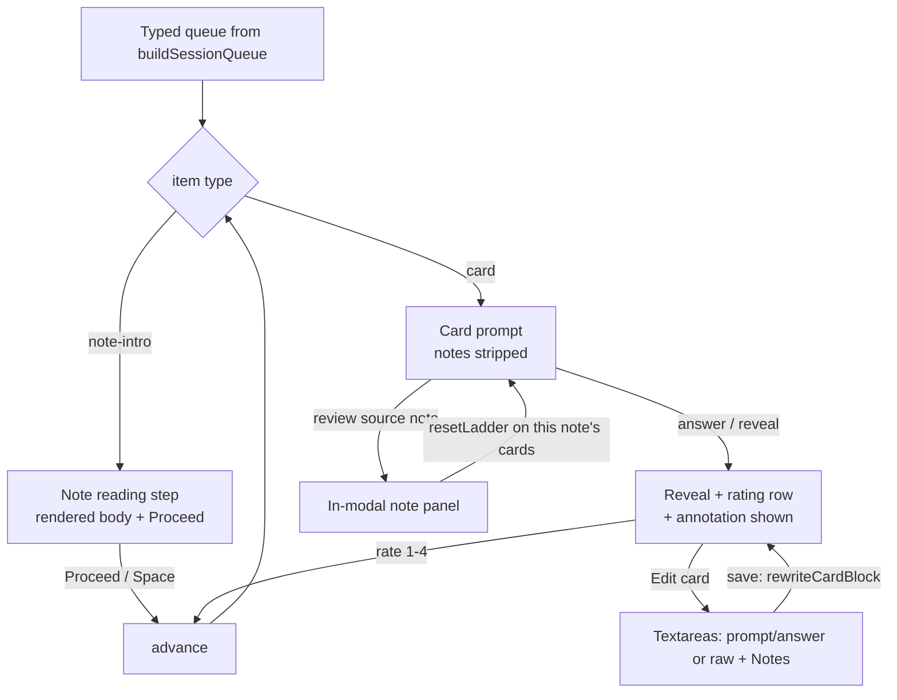

# Session Study Affordances — Note-First Reading, Source Review, Card Editing - Plan

## Goal Capsule

- **Objective:** Extend `engram-flashcards` review sessions with three study affordances: the evergreen note shown as a reading step before its cards on first encounter; a "review source note" panel available on every card that resets that note's scheduling ladder; and post-reveal editing of card question/answer plus hidden annotation notes, persisted to the sidecar.
- **Authority:** This plan; `docs/flashcard-format.md` (extended by U1) as the sidecar contract; the stage-1 plan (`docs/plans/2026-07-17-001-feat-zettel-flashcards-plugin-plan.md`) for architecture it builds on.
- **Stop conditions:** Surface instead of guessing if (a) in-modal note rendering breaks embedded content (images/transclusions) badly enough to need workspace navigation, or (b) card-block rewriting cannot preserve state lines byte-for-byte.
- **Execution profile:** Modifies the existing plugin only (`obsidian-engram/`); one spec extension; one skill touch-up. Plugin version bumps to 0.2.0 with a tagged release.
- **Tail:** Tag + release so BRAT picks up 0.2.0.

---

## Product Contract

### Summary

Sessions become study loops, not just quiz loops: the walk introduces a note by showing its rendered content before ever quizzing it (first encounter only, derived from empty review history, with an always/never settings override); any card offers "review source note" in a collapsible in-modal panel, and using it restarts that exact note's interval ladder (children untouched, history preserved, logged as a reset event); and after reveal the user can edit the card's prompt/answer and attach annotation notes that stay hidden while answering, all persisted into the `<Note>.cards.md` sidecar in a form `/zettel-flashcards` regeneration preserves.

### Problem Frame

The mental-palace walk (stage 1) orders recall correctly but starts cold: a note whose cards have never been reviewed is quizzed before it has ever been *read* inside the loop, and when a question exposes a gap there is no path back to the source without abandoning the session. Card content is also frozen at generation time — the reviewer, who is the best editor of a bad prompt or a missing mnemonic, has no way to fix cards or attach their own cues at the moment they notice the need.

### Requirements

**Note-first reading**

- R1. When the session walk reaches a note none of whose cards has any review-log entry, a reading step showing the note's rendered content (frontmatter stripped, LaTeX and code rendered) appears before that note's cards, with a proceed control (button + Space/Enter).
- R2. Once any of a note's cards carries review history, the reading step is skipped; a settings option overrides to always or never show it (default: first encounter).

**Source review and ladder reset**

- R3. Every card screen offers "review source note", which renders the bound note in a collapsible panel inside the review modal; the session is never closed or navigated away.
- R4. Opening the source note resets the interval ladder for every card of that exact note — interval back to the ladder start so the next successes schedule ≈1 → 4 → ×ease — never touching child notes' cards.
- R5. A reset preserves the card's ease and full review log, appending a distinct reset event; it is not recorded as a failed review.

**Card editing and annotations**

- R6. After a card is revealed, the user can edit its question/answer content and save; edits rewrite that card's block in the sidecar without changing its ID, scheduling state, or other cards.
- R7. Each card supports an annotation Notes section: hidden while answering, rendered after reveal, editable in the same post-reveal editor, stored inside the card's block in the sidecar.
- R8. `/zettel-flashcards` regeneration preserves Notes sections on cards it keeps.

### Key Flows

- F1. First encounter with a note
  - **Trigger:** The queue reaches a note whose cards all lack review history.
  - **Steps:** Reading step renders the note body; user reads, hits Proceed; the note's cards follow.
  - **Outcome:** Recall practice starts primed by one deliberate read; subsequent sessions skip straight to cards (R2).
- F2. Mid-question source review
  - **Trigger:** User clicks "review source note" on any card.
  - **Steps:** Note panel expands in-modal; ladder reset applies to all of that note's cards (in-memory immediately, persisted in the session's batch write); a notice confirms the reset.
  - **Outcome:** User re-studies, continues the session; that note's cards restart the ladder on their next reviews.
- F3. Post-reveal card repair
  - **Trigger:** After reveal, user opens the edit form.
  - **Steps:** Prompt/answer (or raw content for cloze/mcq) and Notes appear as markdown textareas; save rewrites the card block via an atomic vault write and re-renders the reveal.
  - **Outcome:** The sidecar carries the improved card; the annotation appears only post-reveal in future sessions.

### Acceptance Examples

- AE1. **Given** the `Noisy-Top-K-Gating` cards have never been reviewed, **when** the walk reaches that note, **then** the note's content renders with a Proceed control before its first card; **and given** a later session after reviews exist, **then** no reading step appears.
- AE2. **Given** a session on `Mixture-of-Experts` where the user clicks "review source note" on an `MoE-Load-Balancing` card, **then** the panel shows that note in-modal, every `c-000023-*` card's interval resets to the ladder start with a reset event appended and ease/history intact, and no `MoE-Architecture` (sibling) or parent card changes.
- AE3. **Given** a revealed card, **when** the user adds the annotation "remember: f·p, frequency times confidence" and saves, **then** the sidecar's card block gains a Notes section, and next session the annotation is absent at prompt time and visible after reveal.
- AE4. **Given** a card with an annotation, **when** `/zettel-flashcards` regenerates the subtree keeping that card, **then** the annotation survives.

### Scope Boundaries

- **In scope:** the three affordances, the format-spec Notes extension, parser/scheduler support, settings (reading-step mode), skill regeneration-rule touch-up, plugin 0.2.0 release.
- **Deferred to Follow-Up Work:** editing cards outside a session (a card browser); annotation search/export; per-card reset (reset currently applies note-wide by design); wiki-lint checks for Notes sections.
- **Outside this product's identity:** modifying the evergreen note from inside the review modal — note editing stays in the normal Obsidian editor (the panel is read-only).

---

## Planning Contract

### Key Technical Decisions

- KTD1. **The session queue becomes a typed item stream.** `buildSessionQueue` emits `note-intro` items interleaved before a note's card run (pure function, so the first-encounter rule and the R16 walk stay unit-testable); the modal branches on item type. Alternative rejected: modal-side detection of note boundaries — that duplicates walk logic in UI code.
- KTD2. **First encounter is derived, not tracked:** a note is unintroduced iff none of its cards has a review-log entry (or a reset event). No new persistent "seen" state; the sidecar stays the single source of truth (mirrors stage-1 KTD2).
- KTD3. **Reset is a scheduler primitive, not a rating.** `resetLadder(state, now)` → interval 0, due now, ease preserved, reviews preserved plus an appended `reset` event. The review-log entry keeps its single existing field, widened to accept `reset` alongside the four ratings (one field, one parse path; U1 updates the format doc's JSON example). Bucket/relearning logic already keys on `interval === 0` + non-empty log, so reset cards go red and jump to the front of a reopened session with zero extra code — desirable (you just re-read; retrieval practice should follow soon).
- KTD4. **Annotations live in the card block behind a uniform `**Notes**` marker.** Parser splits content at a top-level `**Notes**` line for every card type (cloze/mcq included); prompt-time renderers receive notes-stripped content, reveal renderers get the annotation. Regeneration preserves the section (R8, spec rule). Alternative rejected: a separate annotations file — splits card identity across files and breaks the travel-with-the-card property.
- KTD5. **Edits rewrite one card block in place.** A parser-module `rewriteCardBlock(raw, cardId, newContent)` replaces the block body between its `### card` heading (kept verbatim, ID stable) and the next block, leaving `%% srs %%` lines and all other cards byte-identical. Content edits write immediately via `vault.process` on save (they are content, not scheduling state — the session-end batch stays state-only). Editor UI is markdown textareas: Prompt/Answer fields for `free`/`derivation`/`pseudocode`, one raw-content field for `cloze`/`mcq` (their bodies are single-segment), Notes for all.
- KTD6. **Reading-step mode is a three-way setting** (`first-encounter` default | `always` | `never`), consumed by the queue builder, not the modal.

### High-Level Technical Design

Session item flow with the new affordances (states the modal renders):



Sidecar card block with the Notes extension (directional; U1 owns the spec text):

```markdown
### card c-000023-02
type: derivation

**Prompt**
...
**Answer**
...
**Notes**
remember: f·p — "how often" times "how confidently"; hidden until reveal
```

### Sequencing

U1 (parser/spec) and U2 (scheduler reset) are independent and unblock U3/U4; U3 (queue) precedes U4 (modal UI); U5 releases.

---

## Implementation Units

### U1. Format spec extension and parser support

- **Goal:** Notes sections and card-block rewriting: spec text, parser split of content vs annotation, `rewriteCardBlock`, and reset-event tolerance in state parsing.
- **Requirements:** R6 (rewrite mechanics), R7, R8 (spec rule).
- **Dependencies:** none.
- **Files:** `docs/flashcard-format.md`, `obsidian-engram/src/cards/types.ts`, `obsidian-engram/src/cards/parser.ts`, `obsidian-engram/src/cards/content.ts`, `obsidian-engram/tests/parser.test.ts`, `obsidian-engram/tests/content.test.ts`, fixture update under `obsidian-engram/tests/fixtures/`.
- **Approach:** `Card` gains a `notes` field; the parser splits a card body at the first top-level `**Notes**` line (content before, annotation after) for every type. Review-log entries widen to accept a `reset` kind alongside the four ratings — unknown kinds parse tolerantly. `rewriteCardBlock` preserves the heading and `type:` line, replaces only the body, and leaves every other byte (other cards, `%% srs %%`, retired lines) identical. Spec adds: the Notes rule, the reset event, and the generator obligation to preserve Notes on kept cards.
- **Patterns to follow:** `rewriteStates` in `src/cards/parser.ts` (surgical line-preserving rewrite, round-trip tested).
- **Test scenarios:**
  - Card with a Notes section: parsed `content` excludes it, `notes` carries it; card without Notes → `notes` empty; `**Notes**` inside a fenced code block is not a split point.
  - Cloze card with Notes: `renderCloze` receives stripped content (no annotation leak into prompt or reveal).
  - Covers AE4 semantics at parser level: rewrite of one card's body leaves other cards' bytes and all `%% srs %%` lines identical (full-file string compare).
  - `rewriteCardBlock` on the last card, on a card followed by state lines, and on an unknown ID (no-op + error signal).
  - State line with a `reset` event round-trips through parse/serialize.
- **Verification:** `npm test` green; round-trip property holds on the MoE fixtures.

### U2. Scheduler reset primitive

- **Goal:** `resetLadder` and its interaction with buckets/relearning ordering.
- **Requirements:** R4, R5.
- **Dependencies:** none.
- **Files:** `obsidian-engram/src/scheduler/scheduler.ts`, `obsidian-engram/src/cards/types.ts`, `obsidian-engram/tests/scheduler.test.ts`.
- **Approach:** Per KTD3: interval 0, due now, ease and reviews untouched except one appended reset event (the log's existing field widened to accept `reset`). Subsequent `rate(good)` schedules 1 day, then 4, then ×ease — the ladder restart the user asked for. `isRelearning` already treats interval-0-with-history as front-of-queue; assert that holds for reset cards.
- **Test scenarios:**
  - Reset on a mature card (interval 25, ease 2.35): interval 0, due ≤ now, ease still 2.35, review count +1 with a reset event; following Good ratings → 1 day, then 4, then 9.4 (4 × 2.35 — the preserved ease, not the default).
  - Reset never counts as a rating: no ease penalty applied.
  - Reset card classifies red and sorts to the front of a reopened red session.
  - Reset on a new card is a no-op-safe operation (stays new-equivalent, no crash).
- **Verification:** `npm test` green; ladder-restart progression pinned.

### U3. Typed session queue with note-intro items

- **Goal:** Queue items become `note-intro | card`; the builder interleaves reading steps per KTD1/KTD2/KTD6.
- **Requirements:** R1, R2 (rule side).
- **Dependencies:** U1 (types).
- **Files:** `obsidian-engram/src/ui/session-queue.ts`, `obsidian-engram/src/ui/explorer-badges.ts` (queue consumers), `obsidian-engram/src/main.ts` (review-all command), `obsidian-engram/src/settings.ts`, `obsidian-engram/tests/session-queue.test.ts`.
- **Approach:** Before a note's contiguous card run, emit a `note-intro` item when the mode setting says so (`first-encounter`: no card of that note has any log entry; `always`; `never`). Reorientation runs count as card runs (an unreviewed all-green parent cannot occur, so reorientation notes never trigger intros in practice — assert rather than special-case). Relearning cards pulled to the front keep their intro suppressed (their note has history by definition).
- **Test scenarios:**
  - Covers AE1 (rule): all-new note → intro item immediately before its first card; note with one reviewed card → no intro.
  - Mixed tree: only the never-reviewed notes get intros; order stays parent-before-children with intros adjacent to their note's run.
  - Mode `always` → intro for every contributing note; mode `never` → none.
  - A note contributing zero cards to this session contributes no intro.
  - Error path: an intro item whose note file no longer exists at render time is skipped with a notice (queue carries the path; the modal validates it like it already does for card items).
- **Verification:** `npm test` green; existing walk-order tests still pass unchanged.

### U4. Modal UI: reading step, source panel with reset, post-reveal editor

- **Goal:** Render the three affordances in `ReviewModal`.
- **Requirements:** R1 (render side), R3, R4 (apply side), R6, R7 (UI side).
- **Dependencies:** U1, U2, U3.
- **Files:** `obsidian-engram/src/ui/review-modal.ts`, `obsidian-engram/src/ui/renderers/markdown.ts` (frontmatter-stripped note render helper), `obsidian-engram/src/ui/card-editor.ts`, `obsidian-engram/styles.css`, `obsidian-engram/tests/content.test.ts` (frontmatter strip is pure).
- **Approach:** Reading step: render the note file's body (frontmatter stripped) scrollable, Proceed button, Space/Enter advances; keyboard map stays otherwise unchanged. Source panel: lazy-rendered collapsible under the card; on first open per note per session, apply `resetLadder` to all of that note's cards in-memory, stage the states into the session's update map, and show a one-line notice ("Ladder reset for <note> — N cards"); repeat opens don't re-reset. Editor: post-reveal "Edit card" toggles `card-editor` textareas (per KTD5), save calls `rewriteCardBlock` via `vault.process`, re-parses the block, re-renders the reveal; annotation renders in the reveal area when present. Escape closes editor before closing modal. Dirty-editor guard: attempting to close the modal (X, click-out, Escape past the editor) with unsaved editor changes keeps the modal open and focuses a save-or-discard choice — a hand-written annotation is never silently lost. Missing-note degrade: both the intro step and the source panel validate the note file first; a vanished note skips the step / shows a notice, and no ladder reset is applied.
- **Execution note:** DOM-heavy; keep the frontmatter strip, per-type editor-field mapping, and reset-once-per-session guard in pure functions, and verify the rest by a full session smoke in this vault against the MoE deck.
- **Test scenarios:**
  - Frontmatter strip: note with/without frontmatter, frontmatter containing `---` in a string value.
  - Editor field mapping: `derivation` → Prompt/Answer/Notes fields; `mcq` → raw/Notes; round-trip of an unmodified editor save is byte-identical.
  - Reset-once guard: second panel open in the same session applies no second reset.
  - Dirty-close guard: modal close with unsaved editor text → modal stays open, save-or-discard offered; discard then close proceeds; save then close persists.
  - Error path: "review source note" on a note deleted mid-session → notice shown, panel stays closed, no reset applied to any card.
  - Covers AE2/AE3 (manual): panel reset scoped to the exact note; annotation hidden at prompt, shown after reveal, editable, persisted.
- **Verification:** Full smoke on the MoE deck: intro appears only for never-reviewed notes; panel opens without closing the session; reset notice fires once; sidecar shows the reset events, edits, and Notes after the session.

### U5. Skill alignment, docs, and 0.2.0 release

- **Goal:** Regeneration preserves Notes; docs/settings documented; release cut.
- **Requirements:** R8; distribution.
- **Dependencies:** U1–U4.
- **Files:** `skills/zettel-flashcards/SKILL.md`, `obsidian-engram/README.md`, `obsidian-engram/manifest.json`, `obsidian-engram/versions.json`, `obsidian-engram/package.json`, `CHANGELOG.md`.
- **Approach:** Skill regeneration rules gain "preserve `**Notes**` sections verbatim on kept cards". README documents the three affordances and the reading-step setting. Version 0.2.0, tag == manifest version, release assets via the existing workflow.
- **Test scenarios:** Test expectation: none — docs/release; AE4 is exercised by a manual regeneration spot-check on one annotated card.
- **Verification:** Release `0.2.0` exists with the three assets; BRAT update path picks it up.

---

## Verification Contract

| Gate | Command / procedure | Applies to |
|---|---|---|
| Typecheck + unit tests | `cd obsidian-engram && npx tsc --noEmit && npm test` | U1–U4 |
| Build + install | `npm run build`; copy assets into `.obsidian/plugins/engram-flashcards/` | U4, U5 |
| Vault smoke | Full session on the MoE deck covering AE1–AE3; inspect sidecar diff afterward | U3, U4 |
| Regeneration spot-check | Re-run `/zettel-flashcards` on one annotated note; annotation survives (AE4) | U5 |
| Pre-commit audit | `verifier` agent on the staged diff (repo convention) | all |
| Release smoke | Tag `0.2.0`; workflow green; assets present | U5 |

## Definition of Done

- AE1–AE4 pass (AE1 rule + AE2/AE3 by vault smoke, AE4 by regeneration spot-check).
- All unit gates green; no regression in the stage-1 test suite.
- Release `0.2.0` published with `main.js`/`manifest.json`/`styles.css`.
- `docs/flashcard-format.md` and the skill carry the Notes + reset rules; README documents the reading-step setting.
- No abandoned experimental code in the diff.

---

## Risks & Dependencies

- **Note rendering inside a modal** may surface embed/transclusion quirks (images, `![[...]]`). Mitigation: render read-only via the same `MarkdownRenderer` path already proven for card faces; if an embed misbehaves, degrade to rendering without embeds rather than navigating the workspace (stop condition (a) otherwise).
- **Card-block rewriting is the highest data-risk surface** (user's edits + plugin state in one file). Mitigation: byte-identity tests around untouched regions (U1), immediate single-block writes via `vault.process`, and the stage-1 rule that state lines are only ever touched by `rewriteStates`.
- **Reset-by-peek could feel punitive** if users open the panel reflexively. Mitigation: the notice makes the cost visible each time; per-card or no-reset variants are cheap follow-ups if the note-wide reset proves too aggressive (named in Deferred).

## Sources & Research

- Stage-1 plan and code: `docs/plans/2026-07-17-001-feat-zettel-flashcards-plugin-plan.md`; `obsidian-engram/src/ui/session-queue.ts` (walk + relearning ordering), `src/cards/parser.ts` (`rewriteStates` precedent), `src/scheduler/scheduler.ts` (ladder), `docs/flashcard-format.md` (contract being extended).
- In-session user direction: first-encounter-only reading step; source review = note-scoped ladder reset (children excluded); annotations hidden until reveal.
