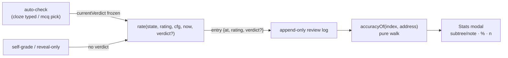

# Verdict Logging and Accuracy Stats - Plan

## Goal Capsule

- **Objective:** Record the raw auto-check verdict (correct/incorrect) alongside the confirmed rating in each card's review log, and surface per-note / per-subtree accuracy in a "Flashcard stats" command. Backward compatible — old log entries simply lack verdicts.
- **Authority:** This plan; `docs/flashcard-format.md` (extended); plan 001 KTD6 (auto-check semantics).
- **Stop conditions:** none anticipated — additive field + read-only stats.
- **Tail:** Plugin 0.3.0 tagged release.

---

## Product Contract

### Summary

Auto-checked answers (typed cloze, MCQ picks) log an optional `verdict` field in the review entry, independent of the rating the user confirms — overriding a botched-typing "incorrect" to Good preserves the failed check. A new command opens a stats view: per-subtree and per-note accuracy percentages (correct ÷ checked) with counts, computed from logged verdicts only. Open-ended cards carry no verdicts and stay out of accuracy math; ratings remain the sole scheduling input.

### Problem Frame

The auto-check verdict currently vanishes at rating time: only the final rating lands in the log, so "how often do I actually get MoE cloze cards right?" is unanswerable — especially once overrides diverge ratings from raw outcomes. The append-only log was designed to absorb exactly this kind of extension without migration.

### Requirements

**Logging**

- R1. When an answer was mechanically checked (typed cloze, MCQ), the resulting review-log entry carries `verdict: correct|incorrect` reflecting the raw check outcome at answer time, unaffected by any rating override.
- R2. Reviews without a mechanical check (open-ended reveals, reveal-without-typing on cloze, `reset` events) carry no verdict; entries without verdicts (including all pre-existing history) parse unchanged and are excluded from accuracy denominators.

**Stats**

- R3. A "Flashcard stats" command opens a view listing, for the zettel tree walked topologically: per-note and per-subtree accuracy (correct ÷ checked, as %) and the checked count; notes/subtrees with zero checked answers display an em dash rather than 0%.
- R4. Accuracy computation is a pure function over the index, unit-testable without Obsidian.

### Acceptance Examples

- AE1. **Given** a typed cloze answer marked incorrect that the user overrides to Good, **then** the persisted entry is `{rating: "good", verdict: "incorrect"}` — the schedule advances, the miss is remembered.
- AE2. **Given** a revealed derivation card rated Hard, **then** its entry has no `verdict` field.
- AE3. **Given** the MoE subtree with 10 checked answers of which 6 were correct, **when** the stats command runs, **then** the subtree row shows 60% (6/10) and each note row shows its own share; a never-checked note shows "—".
- AE4. **Given** review history written before this release, **then** parsing, scheduling, and stats all work — old entries count toward review totals but not accuracy.

### Scope Boundaries

- **In scope:** the verdict field (spec + types + scheduler + modal wiring), the stats command with its per-subtree/per-note table, docs, 0.3.0 release.
- **Deferred for later (stats/heatmap stage):** time-windowed accuracy trends, review heatmaps, graph-view coloring by accuracy, per-card drill-down UI.
- **Outside this product's identity:** inferring verdicts from ratings on open-ended cards — accuracy stays a measure of mechanical checks only.

---

## Planning Contract

### Key Technical Decisions

- KTD1. **Verdict is an optional field on the existing log entry, not a parallel log.** `{at, rating, verdict?}` — JSON round-trip already preserves whole entries, so parser changes are type-level only and no migration exists to run. The absence of the field is the "not checked" signal (R2), which is also what makes old history safe (AE4).
- KTD2. **The raw verdict is captured at check time in its own field, separate from the suggested rating.** `currentAuto` (the suggestion) can be flipped or overridden later; a distinct `currentVerdict` frozen at `checkCloze`/MCQ-answer time is what gets logged, so R1's "unaffected by override" holds by construction — and stays correct if plan 004's verdict-flip UX ever ships.
- KTD3. **Stats live in a read-only modal fed by a pure `accuracyOf` walk.** Reuses `subtreeOf` (topological order) and the existing index; no caching — 131 notes × small logs is trivially recomputable per open.

### High-Level Technical Design

Data flow (the one new seam is the verdict passing through `rate`):

---

## Implementation Units

### U1. Verdict field: spec, types, scheduler

- **Goal:** `rate` accepts and logs an optional verdict; spec documents it.
- **Requirements:** R1 (mechanics), R2.
- **Dependencies:** none.
- **Files:** `docs/flashcard-format.md`, `obsidian-engram/src/cards/types.ts`, `obsidian-engram/src/scheduler/scheduler.ts`, `obsidian-engram/tests/scheduler.test.ts`, `obsidian-engram/tests/parser.test.ts`.
- **Test scenarios:**
  - `rate(..., "correct")` appends `{rating, verdict:"correct"}`; omitted verdict appends an entry with no verdict key (not `undefined`-valued — JSON must stay clean).
  - Covers AE1 at scheduler level: rating good + verdict incorrect coexist in one entry.
  - `resetLadder` entries never carry verdicts.
  - Covers AE4: an entry without verdict round-trips through serialize/parse byte-identically.
- **Verification:** `npm test` green.

### U2. Modal wiring

- **Goal:** Freeze the verdict at check time; pass it through rating.
- **Requirements:** R1 (capture), R2.
- **Dependencies:** U1.
- **Files:** `obsidian-engram/src/ui/review-modal.ts`, `obsidian-engram/tests/integration/session-smoke.test.ts`.
- **Approach:** `currentVerdict` set in `checkCloze` and the MCQ answered-callback, cleared per card; `rateCurrent` forwards it to `rate`. Reveal-without-typing leaves it null (R2).
- **Test scenarios:**
  - Covers AE1 (integration): answer an MCQ wrong, click Good — persisted sidecar entry shows `"verdict":"incorrect"` with `"rating":"good"`.
  - Covers AE2 (integration): a free card rated in the walk persists an entry with no verdict key.
  - Cloze revealed without typing → no verdict.
- **Verification:** `npm test` green; harness walk passes.

### U3. Accuracy computation and stats modal

- **Goal:** `accuracyOf` pure walk + "Flashcard stats" command and modal.
- **Requirements:** R3, R4.
- **Dependencies:** U1 (types); U2 only for meaningful data.
- **Files:** `obsidian-engram/src/scheduler/accuracy.ts`, `obsidian-engram/src/ui/stats-modal.ts`, `obsidian-engram/src/main.ts` (command), `obsidian-engram/styles.css`, `obsidian-engram/tests/accuracy.test.ts`.
- **Approach:** `accuracyOf(index, address)` returns per-note `{checked, correct}` plus subtree rollups in topological order; the modal renders one indented row per note under each top-level subtree, `%` + `(correct/checked)`, em dash when checked is 0. Command iterates root notes like "Review all due" does.
- **Test scenarios:**
  - Covers AE3: fixture tree with mixed verdicts → note and subtree numbers match hand computation; zero-checked note reports checked 0 (rendered as "—").
  - Entries without verdicts (old history, resets) excluded from both numerator and denominator.
  - Empty tree / note without sidecar contributes nothing and doesn't crash.
- **Verification:** `npm test` green; command opens and renders in the vault.

### U4. Docs and 0.3.0 release

- **Goal:** README stats section; spec cross-links; version bump; release.
- **Requirements:** distribution.
- **Dependencies:** U1–U3.
- **Files:** `obsidian-engram/README.md`, `obsidian-engram/manifest.json`, `obsidian-engram/versions.json`, `obsidian-engram/package.json`, `CHANGELOG.md`.
- **Test scenarios:** Test expectation: none — docs/release.
- **Verification:** Release `0.3.0` with the three assets.

---

## Verification Contract

| Gate | Command / procedure |
|---|---|
| Tests + typecheck | `cd obsidian-engram && npx tsc --noEmit && npm test` |
| Build + install | `npm run build`; copy assets to `.obsidian/plugins/engram-flashcards/` |
| Pre-commit audit | `verifier` agent on the staged diff (repo convention) |
| Release smoke | Tag `0.3.0`; workflow green; assets present |

## Definition of Done

- AE1–AE4 pass (AE1/AE2 in the integration harness, AE3 at unit level + a command-open smoke, AE4 by parser round-trip test).
- All gates green; release `0.3.0` published; CHANGELOG, README, and `docs/flashcard-format.md` updated; no abandoned code.
