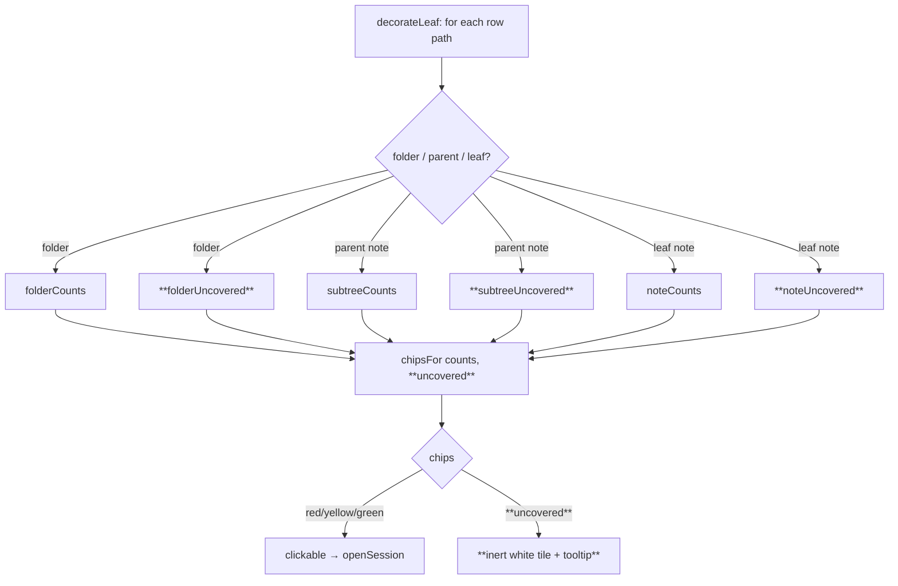

# feat: Uncovered-notes coverage chip in the explorer

## Summary

Add a fourth explorer chip — a **white tile with black font** — that shows how many notes have **no flashcards yet**. It renders beside the existing red/yellow/green count chips on folder rows, paired parent-note rows, and leaf-note rows, using a subtree rollup for folders and parents (identical rollup shape to the card-bucket chips). The chip is **inert** (informational, with a tooltip) — there is nothing to review, so it carries no click handler. It surfaces coverage gaps the moment a note is ingested or an evergreen note is created, since the scanner already rebuilds and re-decorates on vault file events.

**Target component:** `obsidian-engram/` (the Engram Flashcards Obsidian plugin).

---

## Problem Frame

The explorer badges today answer "what do I need to review?" — red (due), yellow (due soon), green (healthy). They are silent about the inverse and equally important question: **which notes have no cards at all?** When a document is ingested or an evergreen note is written, it enters the tree with zero flashcards and gets **no chip whatsoever** — the current `chipsFor` short-circuits to an empty chip list when a scope has no cards (`totalCards === 0`). So the notes most in need of attention (freshly created, uncarded) are the ones rendered blankest.

The user wants a persistent, at-a-glance signal — same visual language as the other chips — for coverage gaps: "next to each folder, how many notes don't have any flashcards tied to them yet," extended (per scoping) to every row the other chips appear on.

---

## Requirements

- **R1** — A new chip counts **notes with zero flashcards** (a note is uncovered when it has no sidecar, or a sidecar with an empty `cards` array). The unit is *notes*, never cards.
- **R2** — On folder rows and paired parent-note rows, the chip shows a **subtree rollup**: the number of uncovered notes anywhere in that subtree, mirroring how `subtreeCounts` / `folderCounts` roll up the card-bucket chips (R9/R10 of the original deck plan).
- **R3** — On leaf-note rows, the chip shows `1` when that note is uncovered, and is absent when it has cards. (Scoping decision: render everywhere the other chips render.)
- **R4** — The chip renders **even when the scope has zero cards total** — the newly-ingested-note case. This is the behavior change that distinguishes it from the existing chips.
- **R5** — The chip is **white background, black font**, visually distinct from the saturated red/yellow/green chips, and legible in both light and dark Obsidian themes.
- **R6** — The chip is **inert**: it displays a count and an accessible tooltip (`"N notes without flashcards"`) but has **no click handler** and does not open a review session.
- **R7** — When a note gains its first card (sidecar created/populated) or loses all cards, the chip updates without manual action, via the existing scanner-rebuild → re-decorate path. No new event wiring.
- **R8** — A fully-covered scope (every note has ≥1 card) shows **no** white chip — zero is omitted, exactly like the red/yellow chips (only green is always-shown).

---

## Key Technical Decisions

- **KTD1 — "Uncovered" is a rollup dimension, not a card bucket.** `Bucket` (`red|yellow|green`) is a *card-state* classification consumed by `bucketOf`/`countCards` and must not be polluted with a note-level concept. Introduce a separate count for uncovered notes computed by walking the same scopes (`subtreeOf`, `notesDirectlyIn`) the card rollups use, and a `ChipKind = Bucket | "uncovered"` at the presentation layer only.

- **KTD2 — `chipsFor` gains an `uncovered` parameter and the zero-cards guard is relaxed.** The current `if (totalCards(counts) === 0) return []` guard is the exact thing hiding the signal for uncarded notes. Restructure so bucket chips still only appear when `totalCards > 0`, but the uncovered chip appears whenever `uncovered > 0`, independent of card total. Order: red, yellow, green, then uncovered (rightmost — it's the "outside the review cycle" signal).

- **KTD3 — Inert rendering reuses the existing `engram-chip-inert` path.** The render loop already supports non-clickable chips (green when practice-ahead is off). The uncovered chip is always inert: no click listener, `cursor: default`. This avoids `openSession` ever receiving a non-`Bucket` argument.

- **KTD4 — Uncovered count is computed alongside `counts` in `decorateLeaf`, per row, from the same `scope`.** For a folder → `folderUncovered`; for a parent note (has folder) → `subtreeUncovered`; for a leaf → `noteUncovered`. This mirrors the existing three-way branch exactly, keeping folder rows and their paired parent-note rows identical (the R9 invariant).

- **KTD5 — White chip styling is theme-fixed, not theme-variable.** Because the tile is always white, the font must be a fixed dark color (not `--text-normal`, which is light in dark themes and would vanish). Use an explicit near-black font plus a `--background-modifier-border` outline so the white tile stays visible against the light-theme explorer background.

---

## High-Level Technical Design

Data flow for one explorer row (unchanged branches in grey, additions in **bold**):



The `chipsFor` decision:

```
chipsFor(counts, uncovered):
    chips = []
    if totalCards(counts) > 0:            # bucket chips unchanged
        if counts.red    > 0: chips += {kind:"red",    count:red}
        if counts.yellow > 0: chips += {kind:"yellow", count:yellow}
        chips += {kind:"green", count:green}    # green always shown when cards exist
    if uncovered > 0:                     # NEW: independent of card total
        chips += {kind:"uncovered", count:uncovered}
    return chips
```
*(Directional guidance, not final code.)*

---

## Implementation Units

### U1. Uncovered-note rollup functions

**Goal:** Provide pure functions that count uncovered notes for a leaf, a subtree, and a folder — parallel to the existing `noteCounts` / `subtreeCounts` / `folderCounts`.

**Requirements:** R1, R2, R3.

**Dependencies:** none.

**Files:**
- `obsidian-engram/src/scheduler/rollup.ts` (modify — add functions)
- `obsidian-engram/tests/rollup.test.ts` (modify — add cases)

**Approach:**
- Add `isUncovered(entry: NoteEntry): boolean` → `true` when `!entry.sidecar || entry.sidecar.cards.length === 0`.
- Add `noteUncovered(entry)` → `isUncovered(entry) ? 1 : 0`.
- Add `subtreeUncovered(index, address)` → count of `isUncovered` over `index.subtreeOf(address)`.
- Add `folderUncovered(index, folderPath)` → mirror `folderCounts`: if a paired note exists, delegate to `subtreeUncovered(pairedAddress)`; otherwise sum `subtreeUncovered` over `index.notesDirectlyIn(folderPath)`.
- Keep signatures free of `nowMs`/`warnWindowHours` — coverage is time-independent (unlike card buckets). Do not thread unused params for false symmetry.

**Patterns to follow:** the existing `noteCounts` / `subtreeCounts` / `folderCounts` structure in the same file — same branch shape, same `noteForFolder` / `notesDirectlyIn` calls.

**Test scenarios** (extend `rollup.test.ts`, reusing its `entry` helper — note `entry(...,[])` already produces a sidecar-less `NoteEntry`, i.e. an uncovered note):
- Leaf with cards → `noteUncovered` returns `0`; leaf with no sidecar (e.g. `c-000004` / `Root/B.md`) → returns `1`.
- `subtreeUncovered("c-000001")` on the existing Root tree → equals the number of carded-less notes in the subtree (with the fixture as-is, `Root/B` is the only uncovered note → `1`); add one more uncovered leaf and assert the count rises to `2`.
- `subtreeUncovered` on an all-covered subtree → `0`.
- `folderUncovered(paired folder)` equals `subtreeUncovered(paired note address)` exactly (R9 parity — the folder-and-its-parent-note invariant).
- `folderUncovered(root folder with no paired note)` sums across the notes directly inside it.
- Edge: a note whose sidecar exists but has an **empty `cards` array** counts as uncovered (guards against `sidecar` being defined-but-empty).

**Verification:** `npm test` (vitest) passes with the new rollup cases; existing rollup cases unchanged.

---

### U2. Extend the chip model for the `uncovered` kind

**Goal:** Teach `chipsFor` about the uncovered chip and relax the zero-cards guard so uncovered notes get a chip.

**Requirements:** R1, R4, R6, R8.

**Dependencies:** U1 (for the count that will be passed in).

**Files:**
- `obsidian-engram/src/ui/chips.ts` (modify)
- `obsidian-engram/tests/chips.test.ts` (create)

**Approach:**
- Introduce `export type ChipKind = Bucket | "uncovered";` and change `Chip.bucket` to `Chip.kind: ChipKind` (rename ripples into `explorer-badges.ts` in U3).
- Change the signature to `chipsFor(counts: Counts, uncovered: number): Chip[]`.
- Guard bucket chips behind `totalCards(counts) > 0` (unchanged behavior for those three), then append the uncovered chip whenever `uncovered > 0` — outside that guard, so a zero-card scope with uncovered notes still returns one chip (R4).
- Preserve the existing ordering (red, yellow, green) and append uncovered last.

**Patterns to follow:** the current `chipsFor` body — same append style, same "zero omitted except green" doc comment (update the comment to describe the uncovered rule).

**Test scenarios** (new `chips.test.ts`):
- `chipsFor({red:2,yellow:0,green:1}, 0)` → red + green chips, no uncovered (unchanged path).
- `chipsFor({red:0,yellow:0,green:0}, 3)` → **exactly one** chip, `kind:"uncovered"`, count `3` (R4 — the newly-ingested-note case that previously returned `[]`).
- `chipsFor({red:1,yellow:0,green:2}, 4)` → red, green, uncovered in that order; uncovered is last.
- `chipsFor({red:0,yellow:0,green:0}, 0)` → `[]` (nothing to show).
- Fully-covered scope with cards: `chipsFor({red:0,yellow:0,green:5}, 0)` → green only, no uncovered chip (R8).

**Verification:** `npm test` passes; new `chips.test.ts` green.

---

### U3. Render the inert white chip in the explorer

**Goal:** Compute the uncovered count per row and render the white, inert chip alongside the others.

**Requirements:** R2, R3, R5, R6, R7.

**Dependencies:** U1, U2.

**Files:**
- `obsidian-engram/src/ui/explorer-badges.ts` (modify)

**Approach:**
- Import `folderUncovered`, `subtreeUncovered`, `noteUncovered`.
- In `decorateLeaf`, alongside the existing `counts` three-way branch, compute an `uncovered` number from the same `scope`:
  - folder path → `folderUncovered(index, path)`
  - parent note (`index.hasFolder(entry)`) → `subtreeUncovered(index, entry.address)`
  - leaf note → `noteUncovered(entry)`
- Pass it to `chipsFor(counts, uncovered)`.
- Update the render loop for `chip.kind`:
  - For `kind === "uncovered"`: force inert (no click listener), CSS class `engram-chip engram-chip-uncovered`, tooltip `"${count} notes without flashcards"` (singular "1 note without flashcards" when count is 1).
  - For the three buckets: unchanged behavior, but read `chip.kind` instead of `chip.bucket` after the U2 rename.
- Confirm the guard that skips rows outside the zettel root still runs first (an uncovered note outside `zettelRoot` must not sprout a chip).
- Confirm the `chips.length === 0 → continue` line still short-circuits clean rows.

**Execution note:** No new event registration — the existing `install()` hooks (`layout-change`, 60s interval, `scanner.onRebuilt`, `onLayoutReady`) already re-decorate on ingest/create/rename/delete. Verify R7 by observation (see U-level verification), not by adding listeners.

**Patterns to follow:** the existing chip-render loop in `decorateLeaf` — reuse the `engram-chip-inert` class and the `createSpan` + `aria-label` pattern already used for green-inert chips.

**Test scenarios:** none at unit level — this is DOM-wiring over already-tested pure functions (`Test expectation: none — behavior is exercised via U1/U2 unit tests plus the U5 manual smoke; the branch logic here is a direct mirror of the existing, tested counts branch).

**Verification:** With the plugin built and loaded, an uncovered leaf shows a white `1`; its ancestor folders/parent notes show white rollup counts; carded notes show none.

---

### U4. White-chip styling

**Goal:** Style `engram-chip-uncovered` as a legible white tile with black font in both themes.

**Requirements:** R5.

**Dependencies:** none (can land with U3).

**Files:**
- `obsidian-engram/styles.css` (modify)

**Approach:**
- Add a `.engram-chip-uncovered` rule after the green rule: white background, fixed near-black font (override the base `.engram-chip { color:#fff }`), and a `1px solid var(--background-modifier-border)` outline so the tile reads against the light-theme explorer background.
- The base `.engram-chip` already sets size, radius, weight; only override `background-color`, `color`, and add `border`. Since uncovered is always inert, it also picks up `engram-chip-inert` (cursor default) from U3.

**Patterns to follow:** the existing `.engram-chip-red/yellow/green` block immediately above.

**Test scenarios:** `Test expectation: none — pure styling; verified visually in U5.`

**Verification:** In both light and dark themes the tile is white, the digits are black and readable, and the tile edge is visible against the sidebar.

---

### U5. Manual smoke + docs touch

**Goal:** Verify the end-to-end behavior in a real vault and record the feature.

**Requirements:** R4, R7.

**Dependencies:** U1–U4.

**Files:**
- `obsidian-engram/README.md` (modify — one line under the chip/legend description)
- `obsidian-engram/manifest.json` + `obsidian-engram/versions.json` (modify — version bump per the plugin's existing release convention)

**Approach:**
- Build (`npm run build` in `obsidian-engram/`), reload the plugin in Obsidian.
- Smoke steps (observe, don't assert in code):
  1. A zettel note with no `.cards.md` shows a white `1`; its ancestor folders show white rollup counts that sum correctly.
  2. Add a card to that note (or let the other session generate its sidecar) → on rebuild the white chip disappears from the leaf and the ancestor rollups decrement (R7).
  3. A fully-carded subtree shows no white chip (R8).
  4. Toggle light/dark theme → tile stays legible (R5).
- Bump the plugin version and add a README note describing the white "no cards yet" chip alongside the existing red/yellow/green legend.

**Test scenarios:** `Test expectation: none — manual verification unit; automated coverage lives in U1/U2.`

**Verification:** All five smoke steps pass; README legend mentions the white chip; version bumped.

---

## Scope Boundaries

**In scope:** the white uncovered-notes chip (folders, parent notes, leaf notes), the rollup functions behind it, the `chipsFor` zero-cards relaxation, styling, and a manual smoke pass.

### Deferred to Follow-Up Work
- **Click-to-open on the white chip** (open the note / first uncovered note to go add cards). Chosen inert for this pass; the render path leaves room to add a listener later.
- A vault-wide "coverage report" or command listing every uncovered note.

### Out of scope (unchanged behavior)
- `cards_due` frontmatter writeback and its red-count semantics.
- Graph-view coloring by coverage.
- Card generation itself (handled in a separate session).
- The card-bucket classification (`bucketOf` and the `Bucket` type stay card-only per KTD1).

---

## System-Wide Impact

- `chips.ts` signature change (`chipsFor` gains a parameter; `Chip.bucket` → `Chip.kind`) has exactly one caller, `explorer-badges.ts` (U3), plus tests — the rename is fully contained. Grep `chip.bucket` / `\.bucket` before finalizing to confirm no other consumer.
- No persistence, index-cache, or frontmatter format changes — `flashcard-index.json` and sidecars are untouched. The coverage count is derived at render time from data the index already carries (`entry.sidecar`).

---

## Verification Contract

- `npm test` (vitest) passes, including the new `chips.test.ts` and the extended `rollup.test.ts`.
- `npm run build` in `obsidian-engram/` succeeds (TypeScript compiles with the renamed `Chip.kind`).
- The five manual smoke steps in U5 pass in a live vault.

## Definition of Done

- U1–U4 implemented; U5 smoke pass observed.
- All applicable requirements (R1–R8) demonstrably satisfied.
- No regression to the existing red/yellow/green chips (same counts, same clickable review sessions).
- Plugin version bumped and README legend updated.

## Sources & Research

Local only — no external research (strong in-repo patterns; fewer than 3 examples was not the case here, the chip/rollup machinery is well-established):
- `obsidian-engram/src/ui/chips.ts`, `src/ui/explorer-badges.ts` — chip model and render loop.
- `obsidian-engram/src/scheduler/rollup.ts`, `src/scheduler/buckets.ts` — the rollup pattern U1 mirrors.
- `obsidian-engram/tests/rollup.test.ts` — fixture and assertion style U1/U2 tests follow.
- `obsidian-engram/styles.css` — existing chip CSS U4 extends.
